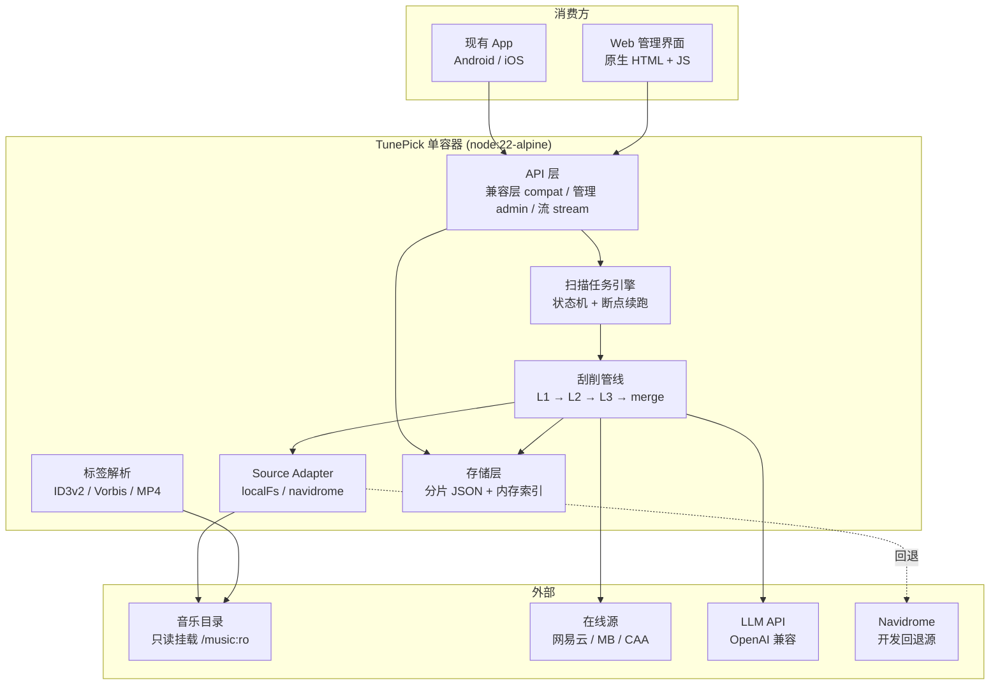
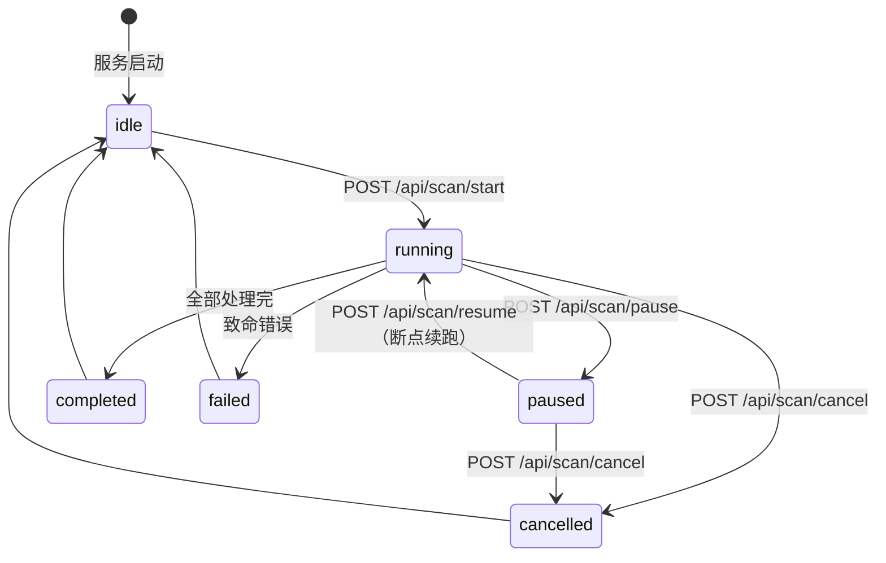
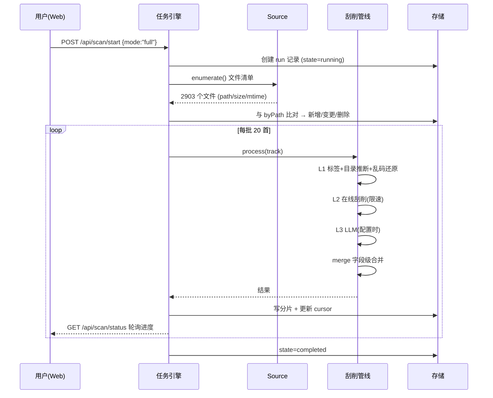
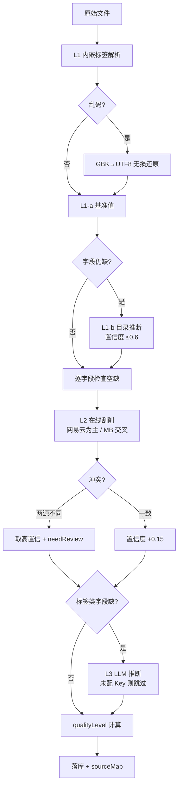

# TunePick 系统设计文档

> 产品名：**TunePick**（PRD §1.2 推荐名）
> 版本：v1.0 · 2026-09-14
> 上游：`docs/PRD.md` v1.1 冻结基线 · `prototype/报告-命中率实测.md` · `prototype/报告-独立复核.md`
> 状态：已定稿，进入实现

---

## 1. 架构总览



**五层职责**：

| 层 | 模块 | 职责 |
|---|---|---|
| 接入层 | `api/` | 兼容层字段映射、管理端点、Range 直通流 |
| 编排层 | `scan/` | 任务状态机、断点续跑、抽样试跑 |
| 领域层 | `scrape/` | L1 清洗 → L2 在线 → L3 LLM → 字段级合并 |
| 源适配层 | `source/` + `tags/` | 文件发现、标签解析、目录推断 |
| 存储层 | `store/` | 分片 JSON、原子写、内存索引、封面落盘 |

---

## 2. 关键技术选型

| 选型点 | 候选 | **选定** | 为什么不选别的 |
|---|---|---|---|
| 存储 | SQLite(`node:sqlite`) / 单文件 JSON / **分片 JSON + 内存索引** | **分片 JSON + 内存索引** | `node:sqlite` 在 Node 22 需 `--experimental-sqlite`，alpine 镜像不稳、PRD 未允许提 flag；单文件 JSON 每次全量重写 6MB 太重。分片后原子写只碰变动分片，2903 首内存占用 ~6MB，1 万首 ~20MB，远低于 512MB 上限 |
| 标签解析 | music-metadata(npm) / **自研零依赖** | **自研** | 硬约束 13「零第三方依赖」。只需 TIT2/TPE1/TALB/TDRC/TCON/APIC/USLT 等 12 个帧，自研 ~400 行可控 |
| 缩略图 | sharp(npm) / 在线源直取 / **在线直取 + 回落原图** | **在线直取 300px；内嵌封面回落到原图** | 零依赖无 JPEG 解码器。网易云封面 URL 支持 `?param=300y300` 直取；内嵌封面无法缩放，按 PRD §4.4 回落链第③条「缩略图不可用但原图可用 → 回落到原图」降级，不违规 |
| 前端 | React+Vite / **原生 HTML+JS** | **原生** | 单容器 + 零依赖；8 个页面均为数据表格/表单，原生足够；引入构建链会破坏「无 npm」约束 |
| 基础镜像 | node:22-alpine / node:24-alpine | **node:22-alpine** | 稳定版、alpine 体积小（~50MB）；业务不依赖 sqlite，无需 Node 24 |
| 并发模型 | worker_threads / **异步池** | **异步池** | 瓶颈是网络 I/O 限速（网易云 2 QPS、MB 1 QPS），不是 CPU。唯一 CPU 密集是标签解析，用 `SCAN_CONCURRENCY` 限制异步并发即可 |

---

## 3. 核心数据结构

### 3.1 曲目记录（PRD §4.1 的 63 字段落地）

直接映射 PRD §4.1 六组字段，落盘为 `data/tracks/<shard>.json`。分片策略：按 `id` 首字母分 16 片，单片 ~180 首，原子写代价小。

**分片内结构**：
```jsonc
{
  "version": 1,
  "tracks": [ { /* 63 字段，见 PRD §4.1 */ } ]
}
```

**内存索引**（启动时构建，写时增量维护）：

| 索引 | 键 → 值 | 用途 |
|---|---|---|
| `byId` | `id` → track | 主键查找 |
| `byPath` | `filePath` → track | 增量扫描去重、目录推断 |
| `byLegacyId` | `legacyId` → track | **FR-75 新旧 id 双解析** |
| `byDurPath` | `durationSec + '|' + fileName` → track | FR-75 兜底匹配 |
| `byAlbum` | `album` → track[] | 专辑区、去重 |
| `byCover` | `coverHash` → coverId | 封面 hash 去重 |

### 3.2 字段级回退合并引擎（`scrape/merge.js`）

PRD §3.5 要求回退粒度是**字段**。核心结构三件套：

```
sourceMap        : { fieldName -> "embed" | "path" | "online:netease" | "llm" | "manual" }
fieldConfidence  : { fieldName -> 0..1 }
lockedFields     : [fieldName]     // 人工锁定，所有自动流程跳过
```

**合并算法**（每个字段独立执行）：

```
function mergeField(track, field, candidates):
    # candidates 按优先级排序: [L1-embed, L1-path, L2-*, L3-llm]
    if field in track.lockedFields:
        return SKIP                      # 人工锁定，绝不覆盖

    for cand in candidates:
        if isEmpty(cand.value): continue
        if cand.source == 'path' and hasUsableEmbed(track, field):
            continue                     # R-FB-09: 目录推断优先级低于内嵌
        if rejects(cand.value): continue # 伪值: [Unknown Artist] / year=0 / 空数组
        if closedVocab(field) and not inVocab(cand.value):
            continue                     # V-01: 越界值一律丢弃

        track[field] = cand.value
        track.sourceMap[field] = cand.source
        track.fieldConfidence[field] = cand.confidence
        return ACCEPTED

    return NO_CANDIDATE                  # 所有源都没有 → 保持空, 标 needReview
```

**置信度加成规则**（原型结论 4.3）：

| 情形 | 处理 |
|---|---|
| 两源（网易云 + MB）给出**相同**歌手 | `fieldConfidence.artist += 0.15`（上限 1.0）—— 最便宜的正确率信号 |
| 两源给出**不同**歌手 | 取高置信度源的值，`needReview = true`，记 `artistConflict` |
| 本地歌手可信 ∧ 在线歌手对不上 | 不覆盖，标 `needReview`（这是 63% 命中里 38 首"曲名独证"的处置） |
| 时长差 ≤ 15s | `+0.05`；≤ 20s 不加不减；> 20s `-0.2`（原型实测：>15s 的 6 首全在 19–29s，>30s 为 0） |

### 3.3 扫描任务状态机（`scan/task.js`）



**持久化**：`data/meta.json` 存 `lastRun`（含 `taskId / state / cursor / done / total / failed / stage / startedAt`）。每处理 `CHECKPOINT_EVERY`（默认 20）首写一次分片 + 更新 cursor。**崩溃后重启**：读到 `state=running` 或 `paused` 的 lastRun → 提供「继续上次」入口，从 cursor 续跑。

---

## 4. 关键流程

### 4.1 全量扫描



### 4.2 单曲三级刮削



---

## 5. 七个设计问题的回答

### Q1. 文件扫描与标签解析

**Source Adapter 抽象**（解决"本地读不到 NAS 文件"的根本问题）：

```js
// source/index.js
module.exports = {
  create(kind, cfg) {
    if (kind === 'localfs')   return require('./local-fs')(cfg);
    if (kind === 'navidrome') return require('./navidrome')(cfg);
  }
}
// 统一接口：enumerate() → [{path, size, mtime}]；readTags(path) → 标签对象
```

| 适配器 | 用途 | 取数方式 |
|---|---|---|
| `localFsSource` | **生产**（Docker 只读挂载 `/music:ro`） | `fs.readdir` 递归 + 自研标签解析 |
| `navidromeSource` | **开发/回退**（本地沙箱验证） | Subsonic `search3.view?query=` 全量 + `getCoverArt.view` |

`SOURCE_KIND` 环境变量切换，默认 `localfs`。**这让整条链路在本地能端到端冒烟验证**——否则写完的代码无法测试。

**标签解析字段映射**（零依赖自研）：

| 格式 | 容器 | 关键帧/原子 | 映射到 Schema |
|---|---|---|---|
| MP3 | ID3v2.3 / v2.4 | `TIT2` `TPE1` `TALB` `TDRC`/`TYER` `TCON` `TRCK` `TPOS` `APIC` `USLT` | `title` `artist` `album` `year` `genre` `trackNo` `discNo` 内嵌封面 内嵌歌词 |
| FLAC / OGG | Vorbis Comment | `TITLE` `ARTIST` `ALBUM` `DATE` `GENRE` `TRACKNUMBER` `METADATA_BLOCK_PICTURE` | 同上 |
| M4A / MP4 | `moov.udta.meta.ilst` | `©nam` `©ART` `©alb` `©day` `©gen` `trkn` `disk` `covr` | 同上 |
| 其他 | — | — | **降级**：仅文件名 + `format="UNKNOWN"` |

**时长**：MP3 用首帧 `bitrate` + 文件大小估算（CBR）；FLAC 用 `STREAMINFO`；MP4 用 `mvhd`。失败则标 `durationSec=0` 并 `needReview`。

### Q2. 存储选型
见 §2。分片 JSON + 内存索引。

### Q3. 字段级回退引擎
见 §3.2。

### Q4. 扫描任务状态机
见 §3.3。断点续跑靠 `cursor` + 分片原子写。

### Q5. Web 界面技术选型
原生 HTML + CSS + JS，`web/` 下 8 个页面共用一套 CSS/JS，服务端 `api/web.js` 直接吐静态文件 + 走 JSON API。管理界面走 **HTTP Basic 鉴权**（`ADMIN_USER`/`ADMIN_PASSWORD`），与 API 的 Bearer 分离（FR-78）。

### Q6. Docker 打包
`node:22-alpine`，非 root 用户（`node` uid 1000），`/music:ro` 只读挂载，`/data` 可写，健康检查 `GET /api/health` 间隔 30s，优雅退出（SIGTERM → 落库 → exit 0）。

### Q7. 兼容层字段映射
**映射做在 API 出口**（`api/compat.js`），Schema 内部保持 PRD 命名：

| 对外（App 契约） | 内部 Schema |
|---|---|
| `albumTitle` | `album` |
| `coverUrl` | `/api/cover/${coverId}?size=300` |
| `durationSec` | `durationSec`（同名） |
| `id` | `id` + `legacyIds` 双向解析 |

路由参数 `id` 解析顺序：`byId` → `byLegacyId` → `byDurPath` 兜底（FR-75）。

---

## 6. 文件清单

| 路径 | 职责 | 预估行数 |
|---|---|---|
| `src/server.js` | HTTP 入口、路由分发、优雅退出 | 220 |
| `src/config.js` | 37 个环境变量读取与默认值 | 160 |
| `src/logger.js` | 结构化日志 + 内存环形缓冲（供日志页） | 90 |
| `src/store/schema.js` | 63 字段定义、默认值、校验、封闭词表校验 | 180 |
| `src/store/db.js` | 分片 JSON 读写、原子写、内存索引 | 320 |
| `src/store/covers.js` | 封面落盘、hash 去重、假图名单、300px 取图 | 200 |
| `src/tags/id3.js` | ID3v2.3/v2.4 解析 | 220 |
| `src/tags/flac.js` | FLAC/OGG Vorbis Comment | 160 |
| `src/tags/mp4.js` | MP4 ilst atoms | 180 |
| `src/tags/index.js` | 格式分发 + 时长获取 | 120 |
| `src/source/index.js` | 适配器工厂 | 40 |
| `src/source/local-fs.js` | 直读挂载目录（生产） | 150 |
| `src/source/navidrome.js` | Subsonic API（开发回退） | 180 |
| `src/scrape/l1.js` | L1：标签清洗 + 目录推断 + 乱码还原 + 质量标记 | 300 |
| `src/scrape/merge.js` | 字段级合并引擎 | 180 |
| `src/scrape/match.js` | 候选打分（复用原型算法） | 200 |
| `src/scrape/l2.js` | L2 编排 + 源调度 | 260 |
| `src/scrape/sources/netease.js` | 网易云（cloudsearch/pc + 端点轮换） | 200 |
| `src/scrape/sources/musicbrainz.js` | MusicBrainz（1 QPS） | 160 |
| `src/scrape/sources/caa.js` | Cover Art Archive | 100 |
| `src/scrape/sources/index.js` | 源注册表与调度 | 80 |
| `src/scrape/l3.js` | L3 LLM 推断 + 词表校验 | 260 |
| `src/scrape/llm-client.js` | OpenAI 兼容客户端 + 厂商预设 | 200 |
| `src/scrape/vocab.js` | 封闭词表 vocab-v2 + 校验 | 120 |
| `src/scan/task.js` | 任务状态机 + 断点续跑 | 300 |
| `src/scan/sampler.js` | 分层抽样（Q-23） | 140 |
| `src/api/index.js` | 路由表 | 120 |
| `src/api/compat.js` | 兼容层（9 端点 + 字段映射） | 280 |
| `src/api/admin.js` | 管理端点（扫描/审阅/源/LLM/统计） | 400 |
| `src/api/stream.js` | Range 只读直通 | 140 |
| `src/api/auth.js` | Bearer + Basic 双鉴权 | 100 |
| `src/web/router.js` | 静态页面路由 + Basic 保护 | 80 |
| `src/web/index.html` 等 8 页 | 界面 | 900 |
| `src/web/app.css` / `app.js` | 共用样式与逻辑 | 500 |
| `Dockerfile` / `docker-compose.yml` / `.dockerignore` | 打包 | 90 |
| `README.md` | 部署与使用 | 200 |
| **合计** | **~40 个文件** | **≈ 8,000 行** |

---

## 7. 共享知识（跨文件约定）

| 项 | 约定 |
|---|---|
| 模块系统 | CommonJS（`require`/`module.exports`），与 `music-player/backend` 一致 |
| 依赖 | **零第三方**。仅 `fs` `path` `http` `https` `crypto` `zlib` `url` + 全局 `fetch` |
| 日志格式 | `[ISO时间] [LEVEL] [模块] 消息 {结构化字段}`，输出到 stdout + 内存环形缓冲 2000 条 |
| 错误码 | 业务错误一律 HTTP 200 + `{ok:false, error:"中文说明", hint:"可执行建议"}`；仅 401/404/500 用 HTTP 状态码 |
| 配置读取 | 统一经 `src/config.js`，禁止散落 `process.env` |
| ID 生成 | 曲目 `tp_` + 8 位 hex；封面 `cv_` + 内容 sha1 前 12 位 |
| 原子写 | 写 `.tmp` → `fs.renameSync` 覆盖，杜绝半写 |
| 伪值判定 | `[Unknown Artist]` / `[Unknown Album]` / `year=0` / 空数组 / 广告串 均视为**不可用** |
| 时间 | 统一 ISO 8601 + `TZ` 时区 |

---

## 8. 待明确事项

| # | 事项 | 当前默认 | 影响 |
|---|---|---|---|
| D-01 | 内嵌封面无法生成缩略图（无 JPEG 解码器） | `?size=300` 回落原图 | 内嵌封面曲目在列表页加载略慢；在线封面不受影响 |
| D-02 | MP3 时长用 CBR 估算，VBR 有误差 | 误差 ±5%，标 `needReview` | 影响时长交叉校验；可后续加 Xing 头解析 |
| D-03 | QQ音乐/酷狗/豆瓣源未实现（PRD Q-08：只做已列明源） | 留注册位不实现 | 覆盖率暂依赖网易云单源 |
| D-04 | 歌词仅网易云源（PRD 实测全库 54%） | — | M-06 目标需下调至 62% |

---

## 9. 依赖包

**零第三方依赖**（硬约束 13）。运行时仅 Node 内置模块 + 全局 `fetch`。
