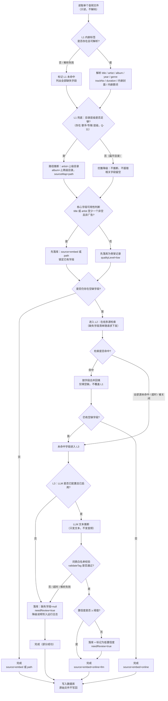

# PRD · NAS 音乐元数据刮削服务

| 项 | 内容 |
|---|---|
| 文档版本 | **v1.1（9 项待确认问题已裁决，本版为冻结基线）** |
| 状态 | ✅ **已冻结（2026-09-13）** —— 9 项已确认结论已落地；其余 11 项采用 v1.0 建议默认值（可随时覆盖）；本次新产生 3 项 P2 待确认项见 §12 |
| 作者 | 许清楚（产品经理） |
| 日期 | 初版 2026-09-07 · 改版 2026-09-13 |
| 语言 | 简体中文 |
| 上游依据 | 12 项已确认决策（见 §0.2） + 2026-09-07 实测曲库画像（3392 首） + 2026-09-13 用户裁决的 9 项待确认问题（见 §0.3） |
| 下游消费者 | 架构师（技术方案）、开发、测试验收 |
| 范围声明 | **本 PRD 只定义"做什么 / 做到什么程度 / 验收口径"，不含框架选型、数据库表结构、目录结构、部署编排细节——属架构师职责** |

---

## 0. 文档说明

### 0.1 如何读这份文档

| 章节 | 读者 | 用途 |
|---|---|---|
| **§0.3 已裁决的关键决策变更** | **架构师（先读这一节）** | **本次改版推翻/重新界定的口径，与 v1.0 差异一览** |
| §1 产品定义 | 全员 | 对齐"为什么做、给谁做、不做什么" |
| §2 用户故事 | 全员 | 需求溯源，每个功能都要能追到故事 |
| §3 三级刮削回退 | 架构师 · 开发 | 核心逻辑，本文档最重要的一章 |
| §4 元数据 Schema | 架构师 · 开发 · 测试 | 字段契约，API 与存储的基准 |
| §5 功能需求池 | 开发 · 测试 | 逐条实现与验收 |
| §6 API 能力清单 | 架构师 · App 端 | 客户端对接依据 |
| §7 Web 管理界面 | 前端 · 设计 | 页面级需求 |
| §8 非功能需求 | 架构师 · 运维 | 资源与部署约束 |
| §9 数据安全与合规 | 全员 | 硬约束，不可妥协项 |
| §10 Out-of-Scope | 全员 | 防止范围蔓延 |
| §11 成功指标 | 全员 | 量化验收 |
| §12 待确认问题 | 主理人 → 用户 | 需用户拍板的空白项 |

### 0.2 已确认决策（不可推翻，本文档仅在此基础上细化）

| # | 维度 | 结论 |
|---|---|---|
| 1 | 项目定位 | 全新独立服务，直读本地音乐文件，不依赖 Navidrome |
| 2 | 刮削策略 | 三级回退：内嵌标签 → 在线刮削 → LLM 推断 |
| 3 | 写回策略 | 只写自己的数据库，原始音频文件严格只读 |
| 4 | 分析深度 | 只解析文本元数据 + LLM，不做音频解码/指纹 |
| 5 | 在线源 | 网易云 / QQ音乐 / 酷狗 + MusicBrainz + Cover Art Archive + 豆瓣及其它中文社区源，每源可单独开关、可限速 |
| 6 | 交付形态 | REST API + Web 管理界面 |
| 7 | 运行环境 | 飞牛 fnOS（x86_64），内存限 512MB~1GB |
| 8 | LLM 接入 | 云端 OpenAI 兼容 API，复用多厂商预设 + 运行时切换；未配置 Key 时优雅降级 |
| 9 | 首期曲库 | 现有 3392 首车载曲库（真实脏数据） |
| 10 | API 消费方 | 核心契约对齐现有 Android/iOS App，改地址即可连 |
| 11 | 任务触发 | 手动触发（Web 点「开始扫描」），定时交给 NAS 计划任务 |
| 12 | 歌词策略 | 本地同名 .lrc → 音频内嵌歌词 → 在线源兜底 |

### 0.3 已裁决的关键决策变更（2026-09-13）

> **本节是给下游架构师的第一落点**：以下口径在本版被**推翻或重新界定**，与 v1.0 表述不同。实施与验收一律以本版为准。

| # | 对应问题 | v1.0 原表述 | v1.1 已裁决结论 | 影响章节 |
|---|---|---|---|---|
| 1 | **Q-02** | §6.2 风险表称"不做播放服务"，与决策 #10「App 只需改地址即可连上」自相矛盾 | **实现 `/api/stream/:id` 只读文件直通**：支持 `Range` 断点续传，**不转码、不封装**，直接流文件字节。「不做播放服务」统一定义为「**不做解码 / 转码 / 播放编排**」 | §6.1 §6.2 §10 §11 |
| 2 | **Q-03** | 专辑维度"基本废弃"，建议用「**片源批次**」语义呈现 | **作废「片源批次」建议**。首页专辑区按 **L2/L3 刮削出的真实专辑**重建；在线源查不到专辑的曲目统一归入「**未知专辑**」分组 | §4.1(albumGroup) §6.1 §6.2 §11 |
| 3 | **Q-01** | 假设 App 不持久依赖曲目 id | **App 确实持久依赖 id**（收藏与播放历史把整条 Track 含 `id` 快照落本地）。新增 **id 别名映射**能力：支持一次性导入「旧 id → 文件路径」映射表，维护 `legacyId` 索引，兼容层**同时接受新旧两种 id**，并提供「文件路径 + 时长」兜底解析 | §4.1(legacyIds) §5.5 §6 §11 |
| 4 | **Q-11** | 假设目录结构未知，待首批扫描后反馈 | 目录结构为**混合型**：部分无损专辑有「歌手/专辑」层级，车载那批扁平。**启用目录结构推断作为 L1 兜底**；扁平目录下必须优雅降级；置信度低于内嵌标签，来源标记为 `path` | §3.3 §3.4 §3.5 §4.1 §5.1 |
| 5 | **Q-09** | 建议 `AUTH_TOKEN` 为空时「仅允许 127.0.0.1」，「拒绝启动」列为备选 | **不采用拒绝启动**（用户本地 `.env` 当前为空值，拒启会挡住首次体验）。API 沿用 `Authorization: Bearer <AUTH_TOKEN>`；**Web 管理界面额外加一层独立鉴权**；`AUTH_TOKEN` 为空时仅允许 `127.0.0.1` 访问并在界面显著告警 | §5.6 §6.3 §7 §8.3 §9.5 |
| 6 | **Q-04** | 建议返回虚拟歌单 | 确认为**只读「系统歌单」**（按 `scene` / `genre` 自动生成，如「深夜驾驶 · 52 首」）；**不提供增删改接口** | §5.5 §6.1 §6.3 |
| 7 | **Q-14** | 假设已有 deepseek Key，直接全量 | 已有可用 Key，但**先跑 100 首抽样验证质量**再全量。新增「抽样试跑 + 质量报告 + 一键转全量」 | §5.1 §7.2 §8.3 §11 |
| 8 | **Q-06** | 建议扩展 scene + `isCover` + genre | **scene 10 → 12**（新增「夜晚独处」「运动健身」）；**FLAGS 6 → 7**（新增 `isCover`）；**genre 本期不动**（保持 15 值）。词表版本升至 **`vocab-v2`** | §4.2 §5.4 §11 |
| 9 | **Q-07** | 建议只存原图、不生成缩略图 | **原图 + 300px 缩略图均落盘**，`?size=300` **必须真实生效**（现有 App 已在调用 `?size=300`，不能只返回原图）；缓存预算上限保留 500MB | §4.4 §6.3 §8.3 |
| 10 | **Q-05 · Q-08 · Q-10 · Q-12 · Q-13 · Q-15 · Q-16 · Q-17 · Q-18 · Q-19 · Q-20** | 各自标注"建议默认值" | **全部采用 v1.0 建议默认值**，逐条结论见 §12 表 | 分散，见 §12 |

#### 0.3.1 本次改版新增的能力（v1.0 完全没有的）

| 新增能力 | 对应裁决 | 需求编号 |
|---|---|---|
| id 别名映射与双 id 解析 | Q-01 | FR-74 / FR-75 |
| 目录结构推断（L1 兜底）+ 目录结构探测报告 | Q-11 | FR-67 / FR-68 |
| 只读文件直通流接口（`Range`） | Q-02 | FR-76 |
| 专辑按刮削结果重建 + 未知专辑分组 | Q-03 | FR-80 + §4.1 `albumGroup` |
| 只读系统歌单 | Q-04 | FR-77 |
| 抽样试跑 + 质量报告 + 一键转全量 | Q-14 | FR-69 / FR-70 / FR-71 |
| 封面 300px 缩略图与 `?size` 生效 | Q-07 | FR-72 |
| 管理界面独立鉴权 + 空 Token 仅本机 | Q-09 | FR-78 / FR-79 |
| 词表版本管理（`vocab-v2`）与按版本重刷 | Q-06 | FR-73 |

#### 0.3.2 本次明确**不扩大**的范围

用户未选以下选项，**不得实现**；如实现方认为不写会留漏洞，走 §12 新增待确认项，不得直接当需求做：

| 不做 | 原因 |
|---|---|
| 系统歌单可编辑（增删改） | 用户只确认「自动生成」，未确认可编辑 |
| 封面多档缩略图（除 300px 外） | 用户只确认 300px |
| `genre` 词表扩展 | 用户明确「本期不动」 |
| 向音乐目录（或其外）生成 `.lrc` / 封面 sidecar | 用户未选，保持 Q-13 默认值 |
| `AUTH_TOKEN` 为空时拒绝启动 | 用户明确不采用 |
| 音频转码 / 解码 / 播放编排 | 与决策 #2、#4 冲突（仅新增只读直通） |

---

## 1. 产品定义

### 1.1 一句话描述

**一个跑在 NAS Docker 里的本地曲库元数据重建服务**：直读挂载目录中的音乐文件，按「内嵌标签 → 在线刮削 → LLM 推断」三级回退补齐歌手、年代、专辑、歌词、流派、场景、封面、简介等元数据，以 REST API + Web 管理界面提供服务，全程不修改原始文件。

### 1.2 产品名建议

| 候选 | 中文 | 英文 / 工程名 | 语义 | 评价 |
|---|---|---|---|---|
| A | **拾音** | TunePick | 从文件里把丢失的信息"拾"回来 | 最短、顺口、贴合"补齐而非创造"的定位；容器名/子域名友好 |
| B | 曲净 | CleanTune | 强调把脏曲库洗干净 | 语义准确，但容易被理解成"清理/去重工具" |
| C | 乐藏 | TuneVault | 强调曲库治理与归档 | 偏"仓库"感，与"刮削"动作关联弱 |

> **推荐 A「拾音 / TunePick」**，工程目录沿用 `nas-music-scraper`（目录名已定，不改）。

### 1.3 目标用户

| 角色 | 画像 | 核心诉求 | 使用频次 |
|---|---|---|---|
| 主用户（曲库所有者） | 自托管音乐爱好者，飞牛 fnOS NAS，3392 首车载曲库；具备基本 Docker 与网络配置能力 | 把废掉的元数据补回来，能按歌手/年代/流派/场景检索 | 首次全量 1 次；之后增量按周/月 |
| 次要用户（家庭/同局域网） | 用现有 Android/iOS App 听歌，不懂技术 | 只要求"能按标签找到歌"，不关心后端 | 高频，只读 |
| 维护者 | 即主用户 | 低维护：不常驻定时器、不频繁改配置、出问题能看日志 | 低频 |

### 1.4 要解决的核心问题

| 现状（实测 2026-09-07，3392 首） | 直接后果 | 目标状态 |
|---|---|---|
| 歌手缺失 730 首 / 21.5%；另有 372 首歌手名是「公众号：小草新剧社…」广告串 | 按歌手浏览不可用，且广告串污染分类 | 歌手完整率 ≥ 95%，广告串 100% 标记 |
| 专辑名仅 5 个不同值，2956 首叫「律动车载音乐」 | 专辑维度**基本废弃** | **Q-03 已裁决**：按 L2/L3 刮削出的**真实专辑**重建；查不到的统一归入「**未知专辑**」（`albumGroup=unknown`） |
| 年份缺失 86.9% | 年代浏览不可用 | 年代覆盖率 ≥ 80%（LLM 推断 + 在线源补） |
| genre 有值 7.7%，mood 有值 0% | 流派/情绪筛选完全不可用 | 流派 ≥ 95%、情绪 ≥ 95%、场景尽力而为 |
| 标题含分隔符 22.1%（如 `Mojito-周杰伦`） | 曲名与歌手粘连，检索命中率低 | cleanTitle / cleanArtist 双字段还原 |
| 乱码标题（如 `17Ò¡°Ú`、`03 ³É¶¼`） | 显示错乱、无法检索 | 乱码标记 + 可修复（可还原的还原，不可还原的标记） |
| bpm = 0 占 99.9% | 无节奏维度 | **放弃 bpm**，改用 LLM 的 energy/valence 替代 |

> **核心判断：这是一个"元数据重建"问题，而不是"给已有标签美化"问题。** 产品价值的主要来源不是补封面和歌词，而是**把丢失的歌手、曲名、年代、流派从脏文本里重建出来**。

### 1.5 与已有 `music-player` 项目的边界

| 维度 | 已有 `music-player` | 本服务 `nas-music-scraper` | 关系 |
|---|---|---|---|
| 定位 | 播放器客户端 + 后端代理适配层 | 元数据刮削与治理服务 | **并列独立** |
| 数据源 | Navidrome（Subsonic）/ Emby / Jellyfin | 直读挂载目录的音频文件 | 不依赖前者 |
| 对外契约 | 已锁定 9 个端点（`SPEC.md` §5） | 对齐该契约 + 新增刮削管理端点 | 兼容 + 扩展 |
| 可复用物 | — | 可**参考**中文封闭词表（`ai-vocab.js`）、LLM 多厂商预设思路、脏数据画像结论 | 仅参考思路，不假设复用代码 |
| 部署 | 已部署 | 独立容器 | 可同机共存 |

### 1.6 产品目标（3 条正交）

| 编号 | 目标 | 可衡量口径 |
|---|---|---|
| G1 | **把元数据做到可用**：脏字段覆盖率显著提升，达到可检索、可分类、可推荐的程度 | 见 §11 成功率指标 |
| G2 | **流水线可干预**：全量扫描异步、可看进度、可中断、可断点续跑；结果可审阅、可人工修正、可锁定 | 中断后重启丢失 ≤ 1 批；锁定字段重跑覆盖率 0 |
| G3 | **零侵入 + 可对接**：原始文件零改写；App 端只改地址即可连上 | 只读自检必须失败；App 兼容端点全部返回 200 |

---

## 2. 核心用户故事

| 编号 | 用户故事 | 覆盖场景 | 优先级 | 验收要点 |
|---|---|---|---|---|
| **US-01** | 作为曲库所有者，我希望在 Web 界面点一次「开始扫描」就能把 3392 首全部刮削一遍，并在扫的过程中看到实时进度和每个阶段的耗时，以便我在任务跑偏时能及时发现 | 首次全量刮削 | P0 | 异步启动，页面 2 秒内出现进度；进度含阶段名/已完成/总数/ETA/失败数 |
| **US-02** | 作为曲库所有者，我希望往 NAS 丢几首新歌后只扫"新文件和改动过的文件"，以便不用每次重跑整库 | 增量补刮 | P0 | 已刮削且文件未变更的曲目跳过；报告中区分"新增/变更/跳过"三个计数 |
| **US-03** | 作为曲库所有者，我希望在曲目详情页看到每一首歌最终采用的元数据、各字段的来源和置信度，并能直接改错、改完锁住，以便重跑时不会把我的修正覆盖掉 | 单曲纠错 | P0 | 可改字段逐项可编辑；保存后 locked=true；重跑后该字段值不变 |
| **US-04** | 作为曲库所有者，我希望按歌手 / 年代 / 流派 / 情绪 / 场景 / 语种任意组合筛选，并能一键把筛选结果存成歌单，以便开车前 30 秒就能选好要听什么 | 按标签检索 | P0 | 多条件 AND 组合；结果数实时反馈；支持分页与排序 |
| **US-05** | 作为 App 使用者，我希望现有 Android/iOS App 只改服务器地址就能读到这套新元数据，以便我不用装新 App | App 消费数据 | P0 | `SPEC.md` §5 的兼容端点全部可用且字段结构一致 |
| **US-06** | 作为曲库所有者，我希望系统把所有"低置信度 / 疑似广告 / 疑似乱码"的曲目单独列出来让我批量过一遍，以便我不需要逐首听 | 低置信度审阅 | P0 | 三个专项视图；支持批量标记、批量改、批量"接受" |
| **US-07** | 作为曲库所有者，我希望在数据源页逐源开关、调限速、看命中率，并能在网页上切换 LLM 厂商与模型、做连通性自检，以便我不改配置文件也能调优 | 数据源与 LLM 配置 | P0 | 每源独立开关 + 限速；LLM 厂商预设一键切换；测试按钮返回耗时与错误原文 |
| **US-08** | 作为曲库所有者，我希望断网或没配 LLM Key 时服务仍能正常启动：内嵌标签照常读、封面歌词照常显示、已有结果照常检索，只是不能补新数据，以便网络波动时服务不至于"全废" | 离线/无 Key 降级 | P0 | 无 Key：L3 跳过且明确标注"未配置"；断网：L2 超时跳过并在日志/UI 说明；已落库数据全部可检索 |
| **US-09** | 作为曲库所有者，我希望刮削任务随时能暂停，NAS 忙的时候还能降低并发，以便不影响到 NAS 上其它服务 | 资源让路 | P1 | 暂停在 ≤ 1 批内生效；并发度可在界面调整并即时生效 |
| **US-10** | 作为曲库所有者，我希望把整库元数据导出成 JSON/CSV，以便我在换服务或做备份时数据能带走 | 数据可携 | P1 | 导出含全部字段与来源；分页或流式下载，不撑爆内存 |
| **US-11** | 作为曲库所有者，我希望先只跑 100 首抽样、看到一份质量报告（JSON 成功率、标签落词表比例、置信度分布、单曲耗时）再决定要不要花几小时跑全量，以便我不在为错方向烧钱 | 抽样试跑验证（Q-14） | P0 | 抽样跑全链路 L1+L2+L3；报告含实测单曲耗时并据此外推全量耗时；可一键转为全量 |
| **US-12** | 作为 App 使用者，我希望换成新服务后我原来的收藏和播放历史还在、爱心图标还是亮的、从收藏点播还能播，以便我感知不到后端换了 | id 兼容与播放延续（Q-01 / Q-02） | P0 | 旧 id 可解析并映射到正确曲目；`/api/stream/<旧id>` 返回 200 且支持 `Range` |

---

## 3. 三级刮削回退策略（核心章节）

### 3.1 总体原则

| 原则 | 说明 |
|---|---|
| **逐级兜底，不整条丢弃** | 上一级只要产出部分字段就先落库，剩余字段继续往下一级要 |
| **字段级回退** | 回退的最小单位是**字段**，不是曲目。L1 有歌手无封面 → 只向 L2 要封面 |
| **上级优先，下级只填空** | L2/L3 **不得覆盖** L1 已有的非空字段；需要覆盖必须由人工修正触发 |
| **每字段留痕** | 每个字段记录来源（embed / online:来源名 / llm / manual）与置信度 |
| **空 != 错** | 拿不到字段就留空 + 标 `unknown`，绝不编造填充（尤其不允许 LLM 编造不存在的歌名） |
| **可审计** | 每次刮削写一条运行记录（时间、来源、耗时、结果），可在日志页回看 |

### 3.2 三级回退主流程



### 3.3 各级输入 / 输出 / 命中判定 / 失败处理

| 级别 | 名称 | 输入 | 输出字段 | 命中判定 | 失败处理 | 是否可关闭 |
|---|---|---|---|---|---|---|
| **L1** | 内嵌标签（+ 目录推断兜底） | 音频文件本体（只读读取容器内标签与元数据块，**不做解码**）+ 文件所在的目录层级 | title, artist, albumArtist, album, year, genre, trackNo, discNo, duration, format, bitrate, 内嵌封面, 内嵌歌词；**目录推断兜底**：artist（上级目录名）、album（上两级目录名） | 读到容器标签即算命中；标签为空视为"L1 空手返回"，不算失败（此时改走目录推断兜底） | 文件损坏/无标签 → 记 `embed=miss`，尝试目录推断后进入 L2；目录层级不足（扁平目录）→ **优雅降级为空值**，不报错、不猜测；单文件异常不中断整批 | 否（必跑，本地零成本） |
| **L2** | 在线刮削 | 清洗后的 `title + artist + album + duration`（**只发文本查询串**） | 歌词(.lrc)、封面、封面 300px 缩略图、album、year、genre、artistBio、albumIntro、trackNo | 至少一个源返回候选且相似度/时长差通过校验 | 单源超时/被限速 → 记录该源失败并继续下一源；全源失败 → 字段留给 L3 | 是（逐源开关；全关时 L2 整体跳过） |
| **L3** | LLM 推断 | title + artist + album + 文件名 + duration + 时长区间（**只发文本**） | cleanTitle, cleanArtist, era, genre, mood, scene, lang, energy, valence, confidence, isAd, isGarbled, isLive, isRemix, isCover, isInstrumental, isShort | 返回 JSON 通过结构校验 **且** 通过封闭词表白名单校验（`validateTag` 语义） | 超时/JSON 解析失败 → 重试 2 次 → 仍失败则记 `llm=fail` 并整批跳过，不阻塞；**不写半成品数据** | 是（未配 Key 或用户关闭时整体跳过） |

**L1 内部的两级来源（Q-11 裁决后新增）**

| 子级 | 来源 | 可补字段 | 相对置信度 | `sourceMap` 取值 | 失效表现 |
|---|---|---|---|---|---|
| **L1-a** | 内嵌标签 | title / artist / album / year / genre / trackNo / discNo / duration / format / 内嵌封面 / 内嵌歌词 | 高（基准） | `embed` | 无标签 → 只做 L1-b |
| **L1-b** | 目录结构推断 | artist（文件所在目录的上一级目录名）、album（上两级目录名） | **低于 L1-a**，建议字段置信度系数 ≤ 0.6 | `path` | 扁平目录（文件直接位于挂载根下或层级不足）→ **必须优雅降级为空值**，不报错、不猜测、不阻断；计入"目录推断未生效"计数 |

> 目录结构为**混合型**：部分无损专辑存在「歌手/专辑」层级，车载那批为扁平结构。两种形态必须同时正确工作。
> L1-b **不得覆盖** L1-a 已解析出的非空字段（见 R-FB-04）。

### 3.4 字段 × 来源 能力矩阵

图例：`●` 可直接取得 ｜ `◐` 部分可得 / 需推断 / 不稳定 ｜ `—` 不可得

| 字段 | L1-a 内嵌标签 | L1-b 目录推断 | L2 在线刮削 | L3 LLM 推断 | 最终兜底策略 |
|---|---|---|---|---|---|
| 曲名 title | ● | — | ● | ◐ 仅清洗不改写 | 保留原文件名（去扩展名） |
| 清洗曲名 cleanTitle | — | — | ◐ 部分源给规范名 | ● 从 `Mojito-周杰伦` 拆洗 | 置空 |
| 歌手 artist | ● | ◐ 上级目录名（置信度低） | ● | ◐ 仅清洗 | 置空并标 `unknown` |
| 清洗歌手 cleanArtist | — | — | ◐ | ● | 置空 |
| 专辑 album | ● | ◐ 上两级目录名（置信度低） | ● | — | 归入「**未知专辑**」分组（`albumGroup=unknown`） |
| 专辑艺人 albumArtist | ● | ◐ | ◐ | — | 回落为 artist |
| 音轨号 trackNo / discNo | ● | — | ● | — | 置空 |
| 时长 duration | ● | — | ◐ 用于交叉校验 | — | 必得 |
| 格式 format / 码率 bitrate | ● | — | — | — | 必得 |
| 年份 year | ◐ 本库 13.1% 有值 | — | ● | ◐ 由 LLM 推 era 再映射 | 置空 |
| 年代 era（封闭 6 值） | ◐ 由 year 映射 | — | ◐ | ● | `未知` |
| 流派 genre（封闭 15 值） | ◐ 本库 7.7% 有值，且原值不在词表内 | — | ◐ 映射到词表 | ● | `其他` |
| 情绪 mood（封闭 12 值） | — | — | — | ● | 置空（**不得编造**） |
| 场景 scene（封闭 12 值） | — | — | — | ● | 置空 |
| 语种 lang（封闭 8 值） | ◐ | — | — | ● | `其他` |
| 能量 energy 1-5 | — | — | — | ● | 3（中性默认，标记 `defaulted`） |
| 明暗 valence 1-5 | — | — | — | ● | 3（同上） |
| 歌词 lyrics | ◐ 部分文件内嵌 | — | ● 在线源主力 | — | 置空 |
| 歌词时间轴 | ◐ | — | ● | — | 无轴则按纯文本存 |
| 封面 cover | ◐ 部分文件内嵌 | — | ● 在线源主力 | — | 内置占位图 |
| 封面缩略图 300px | ◐ 由内嵌原图生成 | — | ◐ 在线源可能直接给 | — | 由原图生成；无原图则无缩略图 |
| 歌手简介 artistBio | — | — | ● 豆瓣 / 网易云 | — | 置空 |
| 专辑简介 albumIntro | — | — | ● | — | 置空 |
| 是否广告 isAd | — | — | — | ● 规则 + LLM 双判 | 规则命中即标 true |
| 是否乱码 isGarbled | ◐ 编码探测 | — | — | ● | 规则命中即标 true |
| 是否翻唱 isCover | — | — | — | ●（`vocab-v2` 新增） | 规则兜底（标题含"翻唱 / cover"） |
| 现场/混音/纯音乐/短音频标记 | ◐ 标题关键词 | — | — | ● | 规则兜底 |
| 置信度 confidence | — | ◐ 固定低系数（≤ 0.6） | ◐ 匹配度分 | ● 模型自报 | 0（视为最低） |

> **关键结论**：本库中 **情绪 / 场景 / 年代 / 能量 / 明暗 / 实体清洗** 六个维度**只能靠 L3**；**歌词 / 封面 / 简介** 主要靠 L2；**title / artist / 音频物理属性** 靠 L1。三级是互补而非冗余——这正是必须做三级回退、而不是"哪个源好用就用哪个"的原因。
> **新增结论（Q-11）**：**artist / album** 多了一条 L1-b 目录推断路径，仅在 L1-a 未给出该字段时生效，且置信度显著更低，用于提升"无损专辑类结构化目录"的还原率；扁平目录下该列整体退化为 `—`，不影响其它字段。

### 3.5 字段级回退（重点规则）

**规则**：L2 结束后，逐字段检查空缺，**只要还有任一字段为空，就继续向下一源/下一级单独索取该字段**，而不是因为"主源命中失败"而丢弃整条记录。


| 规则编号 | 规则 | 说明 |
|---|---|---|
| R-FB-01 | 回退粒度 = 字段 | 一次在线请求可以只为了拿封面，不带其它诉求 |
| R-FB-02 | 空缺字段随请求下发 | 若空缺字段为 0，跳过该级，不产生无意义请求 |
| R-FB-03 | 部分成功 = 成功 | 只要该曲目最终有 ≥ 1 个新字段入库，`status=partial_ok`，不得计为失败 |
| R-FB-04 | 不覆盖上级非空值 | 除 `manual`（人工修正）外，任何来源不得覆盖已有非空值 |
| R-FB-05 | 每个字段记录来源 | 输出 `sourceMap`，如 `{"year":"online:netease","mood":"llm"}` |
| R-FB-06 | 逐字段置信度 | 输出 `fieldConfidence`，低置信度字段在 UI 上标灰并进入审阅队列 |
| R-FB-07 | 人工修正即刻锁 | 任一字段被人工修正后该字段 `locked`，后续所有自动流程跳过 |
| R-FB-08 | 冲突处理 | 同名候选由多个源给出不一致值时（见 §3.8） |
| R-FB-09 | 目录推断优先级低于内嵌标签 | L1-b（`sourceMap=path`）只在 L1-a 未给出该字段时填空；置信度系数 ≤ 0.6，低于任何内嵌标签值 |
| R-FB-10 | 扁平目录必须优雅降级 | 目录层级不足时**不得报错、不得猜测、不得阻断**；相关字段留空并计入"目录推断未生效"计数，由目录结构探测报告（FR-68）呈现 |
| R-FB-11 | 缩略图不参与字段回退 | 缩略图是封面的派生物，缺失时由原图按需生成，不作为独立"空缺字段"触发在线请求 |

### 3.6 在线源使用策略

| 源 | 主要覆盖字段 | 建议优先级 | 是否需要登录态 | 建议限速 | 单独开关 | 备注 |
|---|---|---|---|---|---|---|
| 网易云音乐 | 歌词、封面、专辑、年份、流派标签、歌手简介 | 1 | 部分接口需要，**首期只用免登录接口** | ≤ 1 QPS | 是 | 中文曲库覆盖面最好 |
| QQ 音乐 | 歌词、封面、专辑、年份、流派 | 2 | 部分接口需要 | ≤ 1 QPS | 是 | 作为网易云的补充 |
| 酷狗音乐 | 歌词、封面 | 3 | 否（公开接口） | ≤ 1 QPS | 是 | 歌词兜底 |
| MusicBrainz | 规范曲名/歌手名、专辑、年份、音轨号 | 2 | 否 | **≤ 1 QPS 且必须声明 User-Agent** | 是 | 中文冷门曲目命中率低，但可用于欧美曲目与实体规范化 |
| Cover Art Archive | 仅封面（原图，或由本服务生成 300px 缩略图） | 2 | 否 | ≤ 1 QPS | 是 | 只取封面，不改其它字段 |
| 豆瓣 | 歌手简介、专辑简介、风格、年代 | 3 | 否（公开页面） | ≤ 0.5 QPS | 是 | 以简介为主，字段质量参差 |
| 其它中文社区源 | 待定 | 4 | 待定 | 待定 | 是 | 具体清单见 §12 Q-08 |

| 策略项 | 要求 |
|---|---|
| 逐源开关 | Web 数据源页可逐个启停，改后立即生效（无需重启） |
| 限速 | 每源独立 QPS 上限 + 并发上限 + 请求间随机抖动（100~500ms） |
| 退避 | 连续失败 ≥ 3 次自动指数退避；连续失败 ≥ 10 次自动临时禁用该源并在 UI 报警 |
| 缓存 | 同一查询（规范化后的 title+artist）命中缓存直接返回，默认 TTL ≥ 7 天；缓存为负结果也要缓存（TTL 更短） |
| 超时 | 单请求默认 8 秒；超时即跳过该源，不阻塞整批 |
| 幂等 | 同一曲目重复刮削不得重复落封面文件（按 hash 去重） |

### 3.7 歌词三级策略（对应决策 #12）

| 级别 | 来源 | 命中判定 | 输出形态 | 失败处理 |
|---|---|---|---|---|
| L-A | 音乐文件**同目录同名 `.lrc`** | 存在且可读 | 完整 LRC 文本（带时间轴） | 不存在 → 下一级 |
| L-B | **音频文件内嵌歌词**（USLT / LYRICS 等标签） | 标签存在且非空 | 可能无时间轴 | 无 → 下一级 |
| L-C | **在线源**（网易云 → QQ → 酷狗） | 返回非空歌词体 | 优先带时间轴的 LRC；无轴则纯文本 | 全失败 → 留空并记 `lyrics=miss` |

| 歌词相关约束 | 要求 |
|---|---|
| 格式 | 优先 LRC（`[mm:ss.xx]` 时间轴）；无时间轴时存纯文本并标 `lyricsHasTimeline=false` |
| 清洗 | 去除在线源返回中的翻译行/版权行以外的干扰要谨慎——**首期不做翻译合并**，只保留原文与可选翻译行并保留原始行序 |
| 不落盘 | 首期**不写回** `.lrc` sidecar 文件、不写入音频标签（见 §9.1 与 §12 Q-13） |
| 对外 | 按 `text/plain; charset=utf-8` 返回 LRC 原文 |

### 3.8 在线候选冲突与匹配规则

| 场景 | 决策规则 |
|---|---|
| 多源返回不同 album | 优先取"与 title+artist 相似度最高"的源；相似度并列时按源优先级（§3.6） |
| 多源返回不同 year | 若来源为发行年份 vs 专辑年份，**优先专辑年份**；不一致时取多源众数值；仍冲突则标记 `yearConflict=true` 供人工确认 |
| 多源返回不同封面 | 按源优先级取第一张可用图；封面按 hash 去重；**不做多封面切换 UI**（首期只保留 1 张主封面）；主封面确定后派生 300px 缩略图（见 §4.4） |
| 时长差异过大（> 15 秒） | 判定为**不同版本**（Live/Remix/翻唱），不合并字段，仅记录候选并标 `needReview=true` |
| 歌手名与源差异 | L1 优先；若 L1 值为广告串/乱码，则允许 L2 结果替换，并记录 `overrodeBy=online:<源>` |

---

## 4. 元数据 Schema

### 4.1 字段总表

> 类型说明：`str` 字符串 / `int` 整数 / `num` 小数 / `bool` 布尔 / `enum` 封闭词表 / `enum[]` 封闭词表数组 / `obj` 结构体
> 来源说明：`FS` 文件系统 / `L1` 内嵌 / `L2` 在线 / `L3` LLM / `SYS` 系统生成 / `MANUAL` 人工

#### A. 标识与文件属性

| 字段名 | 含义 | 类型 | 必填 | 来源 | 示例 |
|---|---|---|---|---|---|
| `id` | 曲目唯一标识（由服务生成，稳定不变） | str | 是 | SYS | `tp_0001a2b3` |
| `filePath` | 相对挂载根目录的路径（**内部字段，不外发**） | str | 是 | FS | `车载音乐/2020/Mojito.mp3` |
| `fileName` | 文件名 | str | 是 | FS | `Mojito-周杰伦.mp3` |
| `fileExt` | 扩展名 | str | 是 | FS | `mp3` |
| `fileSizeBytes` | 文件字节数 | int | 是 | FS | `8912345` |
| `fileMtime` | 文件修改时间（用于增量变更检测） | str(ISO) | 是 | FS | `2026-03-11T10:22:00+08:00` |
| `legacyIds` | **旧系统 id 别名**（Q-01 新增）。来自「旧 id → 文件路径」映射表；用于兼容 App 已持久化的收藏与播放历史 | str[] | 否 | 导入 | `["nd_tr_8f2a1c"]` |
| `dirDepth` | 文件所在目录相对挂载根的层级深度（0 = 直接位于根下）。用于目录结构探测报告与 L1-b 生效判定 | int | 是 | FS | `2` |
| `format` | 容器/编码格式 | str | 是 | L1 | `MP3` / `FLAC` / `M4A` |
| `bitrate` | 码率（kbps） | int | 否 | L1 | `320` |
| `sampleRate` | 采样率（Hz） | int | 否 | L1 | `44100` |
| `durationSec` | 时长（秒） | int | 是 | L1 | `215` |

#### B. 核心元数据

| 字段名 | 含义 | 类型 | 必填 | 来源 | 示例 |
|---|---|---|---|---|---|
| `title` | 原始曲名（未经清洗） | str | 是 | L1 / 文件名兜底 | `Mojito-周杰伦` |
| `cleanTitle` | 清洗后曲名 | str | 否 | L3（L2 辅助） | `Mojito` |
| `artist` | 原始歌手名（未经清洗） | str | 否 | L1 / L2 | `[Unknown Artist]` |
| `cleanArtist` | 清洗后歌手名 | str | 否 | L3（L2 辅助） | `周杰伦` |
| `albumArtist` | 专辑艺人 | str | 否 | L1 / L2 | `周杰伦` |
| `album` | 专辑名 | str | 否 | L1 / L1-b / L2 | `律动车载音乐` |
| `albumGroup` | **专辑分组语义**（Q-03 新增）：`real` = 由 L2/L3 刮削出的真实专辑；`unknown` = 在线源查不到，统一归入「未知专辑」 | enum | 是 | SYS | `real` / `unknown` |
| `albumIsPlaceholder` | 专辑名是否为无意义占位（如"律动车载音乐"） | bool | 否 | SYS 规则 | `true` |
| `trackNo` / `discNo` | 音轨号 / 碟号 | int | 否 | L1 / L2 | `3` / `1` |
| `year` | 发行年份（4 位） | int | 否 | L1 / L2 / L3 推断 | `2020` |
| `era` | 年代（封闭 6 值） | enum | 是 | L3 / `year` 映射 | `2020s` |

#### C. 标签类字段（**全部使用封闭词表**）

| 字段名 | 含义 | 类型 | 必填 | 来源 | 示例 |
|---|---|---|---|---|---|
| `genre` | 流派（封闭 15 值选 1） | enum | 是 | L1 映射 / L2 映射 / L3 | `流行` |
| `mood` | 情绪（封闭 12 值，1-3 个） | enum[] | 否 | L3 | `["怀旧","浪漫"]` |
| `scene` | 适用场景（封闭 10 值，0-3 个） | enum[] | 否 | L3 | `["深夜驾驶","高速长途"]` |
| `lang` | 语种（封闭 8 值选 1） | enum | 是 | L3 / L1 | `国语` |
| `energy` | 能量值，用于歌单曲线编排 | int(1-5) | 否 | L3 | `4` |
| `valence` | 明暗值（1 忧郁 / 5 明亮） | int(1-5) | 否 | L3 | `3` |
| `customTags` | 人工补充的自由标签（**不参与自动聚合筛选**） | str[] | 否 | MANUAL | `["婚礼","KTV必点"]` |

#### D. 歌词与图片（存储形态单独说明，见 §4.3 / §4.4）

| 字段名 | 含义 | 类型 | 必填 | 来源 | 示例 |
|---|---|---|---|---|---|
| `lyrics` | 歌词全文（LRC 或纯文本） | str | 否 | L-A / L-B / L-C | `[00:12.30]麻烦给我的爱人来一杯Mojito` |
| `lyricsHasTimeline` | 是否带时间轴 | bool | 否 | SYS | `true` |
| `lyricsSource` | 歌词来源 | enum | 否 | SYS | `local-lrc` / `embedded` / `online:netease` |
| `coverId` | 主封面标识（指向封面文件，**库内不存二进制**） | str | 否 | SYS | `cv_9f3ab1` |
| `coverMime` | 封面 MIME | str | 否 | SYS | `image/jpeg` |
| `coverWidth` / `coverHeight` | 封面尺寸 | int | 否 | SYS | `600` / `600` |
| `coverHash` | 封面内容 hash（去重用） | str | 否 | SYS | `sha1:9f3a…` |
| `coverSource` | 封面来源 | enum | 否 | SYS | `embedded` / `online:netease` / `online:caa` |
| `coverSizes` | **已落盘的尺寸档位**（Q-07 新增） | int[] | 否 | SYS | `[0, 300]`（0 表示原图） |

#### E. 文本简介

| 字段名 | 含义 | 类型 | 必填 | 来源 | 示例 |
|---|---|---|---|---|---|
| `artistBio` | 歌手简介（纯文本，建议 ≤ 1000 字） | str | 否 | L2（豆瓣/网易云） | `周杰伦，华语流行歌手…` |
| `albumIntro` | 专辑简介（纯文本，建议 ≤ 1000 字） | str | 否 | L2 | `本专辑收录…` |
| `bioSource` | 简介来源 | enum | 否 | SYS | `online:douban` |

#### F. 质量与治理字段

| 字段名 | 含义 | 类型 | 必填 | 来源 | 示例 |
|---|---|---|---|---|---|
| `confidence` | 整体置信度（0-1） | num | 是 | L3 / L2 匹配度 | `0.92` |
| `fieldConfidence` | 逐字段置信度 | obj | 否 | SYS | `{"year":0.7,"mood":0.9}` |
| `sourceMap` | 逐字段来源 | obj | 是 | SYS | `{"artist":"embed","year":"online:netease","mood":"llm"}` |
| `qualityLevel` | 质量分级 `high` / `medium` / `low` | enum | 是 | SYS | `medium` |
| `needReview` | 是否需要人工审阅（低置信度或存在冲突） | bool | 是 | SYS | `true` |
| `isAd` | 是否为广告/引流内容（歌手或曲名含公众号等） | bool | 是 | 规则 + L3 | `true`（372 首广告串） |
| `isGarbled` | 标题/歌手是否为乱码或不可读字符 | bool | 是 | 规则 + L3 | `true`（如 `17Ò¡°Ú`） |
| `isLive` | 现场版 / Live | bool | 是 | L3 + 关键词 | `false` |
| `isRemix` | 混音 / Remix / DJ 版 / 改编 | bool | 是 | L3 + 关键词 | `true` |
| `isInstrumental` | 纯音乐 / 伴奏 / 无人声 | bool | 是 | L3 + 关键词 | `false` |
| `isShort` | 短音频 / 音效 / 铃声（通常 < 60 秒） | bool | 是 | L3 + 时长规则 | `false` |
| `isCover` | **翻唱版本标记**（Q-06 / `vocab-v2` 新增）。与 `isLive` / `isRemix` 语义不同：指他人重新演唱的版本 | bool | 是 | L3 + 关键词规则 | `false` |
| `isDuplicate` | 疑似重复曲目（同 cleanArtist+cleanTitle 且时长接近） | bool | 否 | SYS | `false` |
| `lockedFields` | 已人工锁定的字段名列表 | str[] | 否 | MANUAL | `["cleanArtist","year"]` |
| `manualNote` | 人工备注 | str | 否 | MANUAL | `此曲为翻唱版本` |
| `modelVersion` | 产出标签的模型与词表版本 | str | 否 | SYS | `deepseek-v4-flash/vocab-v2` |
| `scrapeStage` | 已完成到的阶段 | enum | 是 | SYS | `L3_done` / `L2_done` / `L1_only` |
| `createdAt` / `updatedAt` | 创建 / 更新时间 | str(ISO) | 是 | SYS | `2026-09-07T14:02:11+08:00` |

> **字段总数**：标识与文件 12 + 核心元数据 12 + 标签 7 + 歌词图片 10 + 简介 3 + 质量治理 19 = **63 个字段**（v1.0 为 58，本版新增 5 个：`legacyIds`、`dirDepth`、`albumGroup`、`coverSizes`、`isCover`）。

### 4.2 封闭词表（基于 `music-player/backend/ai-vocab.js` 取值，本版升至 `vocab-v2`）

> 词表设计依据：本库以华语车载音乐为主（2956 首同属「律动车载音乐」），不照搬西方分类（metal / punk / gospel 在此库几乎不存在）。
> **本版变更（Q-06 裁决，2026-09-13）**：`scene` 10 → 12，`FLAGS` 6 → 7，`genre` **本期不扩展**（保持 15 值）。版本号 **`vocab-v1` → `vocab-v2`**。

| 维度 | 数量 | 取值 |
|---|---|---|
| **情绪 mood**（选 1-3） | 12 | 怀旧 · 伤感 · 治愈 · 浪漫 · 励志 · 欢快 · 慵懒 · 孤独 · 热血 · 宁静 · 思念 · 释然 |
| **流派 genre**（选 1） | 15 | 流行 · 民谣 · 摇滚 · 古风 · 电子 · 舞曲 · 说唱 · R&B · 爵士 · 轻音乐 · 民族 · 乡村 · 粤语流行 · DJ串烧 · 其他 |
| **场景 scene**（选 0-3） | **12** | 深夜驾驶 · 高速长途 · 城市通勤 · 周末自驾 · 雨天 · 黄昏 · 海边 · 聚会 · 专注工作 · 睡前 · **夜晚独处** · **运动健身** |
| **语种 lang**（选 1） | 8 | 国语 · 粤语 · 闽南语 · 英语 · 日语 · 韩语 · 纯音乐 · 其他 |
| **年代 era**（选 1） | 6 | 80s及更早 · 90s · 2000s · 2010s · 2020s · 未知 |
| **特殊标记 FLAGS** | **7** | isAd · isGarbled · isLive · isRemix · isInstrumental · isShort · **isCover** |

**本版新增词表项的语义（避免与既有值混淆）**：

| 新增值 | 语义 | 与既有值的边界 |
|---|---|---|
| `夜晚独处`（scene） | 非驾驶场景的夜间个人收听 | 与 `深夜驾驶` 的区别是**不在车上**；车载库中若无法判断是否在驾驶，优先给 `深夜驾驶` |
| `运动健身`（scene） | 跑步 / 健身房 / 高节奏持续场景 | 与 `高速长途` 的区别是**在陆地上运动而非驾车**；两者可同时命中 |
| `isCover`（FLAGS） | 他人重新演唱的版本（翻唱） | 与 `isLive`（现场版）、`isRemix`（混音改编）**互不替代**，可同时为 true |

**词表使用约束（硬要求）**：

| 编号 | 约束 |
|---|---|
| V-01 | 五个维度的取值**必须**来自上表；任何越界值一律丢弃，不落库 |
| V-02 | `genre` 缺失时回落为 `其他`；`lang` 缺失回落 `其他`；`era` 缺失回落 `未知` |
| V-03 | 一条记录若 `mood` 为空**且** `genre` 为 `其他`，视为"模型没看懂"，不落 L3 结果，标 `needReview=true` |
| V-04 | `energy` / `valence` 越界时夹紧到 1-5；非数字回落 3 并标 `defaulted` |
| V-05 | 词表变更**必须**升版本号；本版为 **`vocab-v2`** |
| V-06 | 词表版本变更后**必须**支持按版本批量重刷：只重跑 `modelVersion` 中词表版本 ≠ 当前的曲目（对应 FR-73） |
| V-07 | 每条标签记录**必须**写入产出它的词表版本（如 `deepseek-v4-flash/vocab-v2`），供版本分布统计与重刷定位 |

**词表扩展结论（Q-06 已裁决 · 2026-09-13）**：

| 维度 | v1.0 建议 | **裁决结果** | 理由 / 说明 |
|---|---|---|---|
| genre | 建议新增 `戏曲` / `古典` / `儿歌` / `网络热歌` | ❌ **本期不扩展，保持 15 值** | 用户明确"genre 不动"。首期先观察审阅队列中的归类困难样本，再做判断 |
| mood | 建议新增 `甜蜜` / `洒脱` | ⏸ **不扩展** | 无用户异议但也未采纳；保持 12 值 |
| scene | 建议新增 `夜晚独处` / `运动健身` | ✅ **已采纳，10 → 12** | 现有 10 值偏车载，非驾驶场景（家庭收听、运动）无法归类 |
| lang | 无 | ➖ 不变（8 值） | — |
| era | 无 | ➖ 不变（6 值） | — |
| FLAGS | 建议新增 `isCover` | ✅ **已采纳，6 → 7** | 本库疑似含大量翻唱版本，与 Live/Remix 语义不同，可辅助去重 |

> 词表变更已使版本号升至 **`vocab-v2`**；已按 V-06 要求支持按版本批量重刷（FR-73）。

### 4.3 歌词存储形态

| 项 | 规定 |
|---|---|
| 存储位置 | 元数据库内以文本字段存**歌词全文**（不含二进制） |
| 编码 | 统一 UTF-8；来源为 GBK/BIG5 时必须转码后再入库 |
| 格式 | 优先 LRC 带时间轴；无时间轴则纯文本 + `lyricsHasTimeline=false` |
| 大小上限 | 单曲歌词 > 50KB 视为异常，截断并记日志（防脏源返回整页 HTML） |
| 内容清洗 | 剔除 HTML 标签、脚本；保留空行结构；**不做翻译合并**（首期） |
| 落盘 | **不写回文件系统**、不生成 `.lrc` sidecar、不写入音频标签（硬约束，见 §9.1） |
| 对外接口 | `GET /api/track/:id/lyric` → `text/plain; charset=utf-8`，直接返回 LRC 原文 |
| 未命中表现 | 接口返回 200 + 空内容（而非 404），并在 body 中带 `available:false` 说明，便于 App 区分"没歌词"与"接口挂了" |

### 4.4 封面存储形态

| 项 | 规定 |
|---|---|
| 存储位置 | 二进制**不入库**；落盘到服务的可写数据目录，库内只存 `coverId` + 元信息 |
| 单曲封面数 | 首期**仅保留 1 张主封面**（不做多图切换） |
| 去重 | 按内容 hash 去重，同专辑多曲共享同一封面文件 |
| **尺寸档位（Q-07 裁决）** | **两档：原图 + 300px 缩略图**。原图保持来源尺寸（在线源通常 300~1000px），缩略图长边固定 300px、等比缩放、不放大（原图长边 < 300px 时缩略图直接复用原图） |
| **缩略图生成时机** | 封面落盘后立即生成，与元数据同批完成；**不等请求时实时生成**（避免首次访问卡顿）。来源在线源若直接提供 300px 档位则直接采用，不重复生成 |
| **命名与索引** | 库内不存二进制路径；以 `coverId` + `coverSizes`（如 `[0, 300]`）表达可用档位。具体命名规则由架构师定义，但**必须**满足：同一 `coverId` 的两个档位可被稳定区分与定位 |
| `?size` 参数取值规则 | `GET /api/cover/:coverId?size=300` 表示 300px 档位。**取值规则**：① 精确命中档位 → 返回该档位；② 未命中（如 `?size=150`、`?size=999`）→ **回落到 300px 档位**；③ 缩略图不可用但原图可用 → **回落到原图**（保证 App 不白图）；④ 均不可用 → 返回占位图 |
| 格式 | 优先 JPEG；PNG/WebP 同样接受，按实际 MIME 返回 |
| 磁盘预算 | 上限 **500MB**（Q-07 裁决保留）。估算：3392 首 × 平均 60KB ≈ 200MB 原图；若按"每张专辑一份封面 + 300px 缩略图"计则更低 |
| 对外接口 | `GET /api/cover/:coverId?size=` （带强缓存头）；兼容端点返回的 `coverUrl` 指向该地址 |
| 未命中表现 | 返回内置占位图（1 张，静态资源），App 侧无需额外处理 |

### 4.5 质量标记与治理规则

| 标记 | 判定方式 | 用途 |
|---|---|---|
| `isAd` | 规则：歌手/曲名匹配引流关键词（如"公众号"、"加微信"、"资源库"、"仅供试听"）→ 直接置 true；LLM 二次确认 | 归类时**排除**；UI 单独视图批量处理（本库已知 372 首） |
| `isGarbled` | 规则：字符集探测 + 可打印字符占比阈值；LLM 二次确认 | 单独视图；可尝试编码还原，还原成功则更新 title/artist 并保留原值到 `manualNote` |
| `needReview` | `confidence < 0.6` **或** `yearConflict` **或** `isAd` **或** `isGarbled` **或** 核心字段（artist/era/genre）为空 | 汇入审阅队列 |
| `qualityLevel` | `high`：核心 6 字段（cleanArtist/era/genre/mood/cover/lyrics）中 ≥ 5 有值且 confidence ≥ 0.8；`medium`：≥ 3 有值；`low`：其余 | 概览页分布图 + 排序降权 |
| `lockedFields` | 人工修正后自动写入 | 所有自动流程跳过该字段 |

### 4.6 字段级来源与置信度示例

```jsonc
{
  "id": "tp_0001a2b3",
  "legacyIds": ["nd_tr_8f2a1c"],          // Q-01 新增：旧 id 别名，供 App 老收藏/历史解析
  "dirDepth": 2,                          // Q-11 新增：目录层级深度，用于目录推断生效判定
  "title": "Mojito-周杰伦",
  "cleanTitle": "Mojito",
  "artist": "[Unknown Artist]",
  "cleanArtist": "周杰伦",
  "album": "律动车载音乐",
  "albumGroup": "unknown",                // Q-03 新增：online 查不到真实专辑 → 归入「未知专辑」
  "albumIsPlaceholder": true,
  "year": 2020,
  "era": "2020s",
  "genre": "流行",
  "mood": ["浪漫", "欢快"],
  "scene": ["周末自驾", "黄昏"],           // scene 词表已升至 12 值（vocab-v2）
  "lang": "国语",
  "energy": 4,
  "valence": 4,
  "lyricsSource": "online:netease",
  "lyricsHasTimeline": true,
  "coverSource": "online:caa",
  "coverSizes": [0, 300],                 // Q-07 新增：原图 + 300px 缩略图
  "confidence": 0.92,
  "fieldConfidence": { "year": 0.7, "era": 0.7, "mood": 0.92, "genre": 0.95 },
  "sourceMap": {
    "cleanArtist": "llm", "cleanTitle": "llm", "era": "llm",
    "year": "online:netease", "lyrics": "online:netease", "cover": "online:caa",
    "album": "path"                       // Q-11 新增来源类型：来自目录结构推断
  },
  "qualityLevel": "high",
  "needReview": false,
  "isAd": false, "isGarbled": false,
  "isLive": false, "isRemix": false, "isCover": false, "isInstrumental": false, "isShort": false,
  "modelVersion": "deepseek-v4-flash/vocab-v2",
  "scrapeStage": "L3_done"
}
```

---

## 5. 功能需求池（P0 / P1 / P2）

> 验收标准统一使用 EARS 句式：`While …` / `If …` / `When …` 系统**必须** …
> 优先级定义：**P0 = 首期必须有（缺了产品不成立）**；**P1 = 首期应有（可延后一个小版本）**；**P2 = 后续增强**

**需求池总览（v1.1 口径，FR-01 ~ FR-80）**

| 分组 | 章节 | 条数 | 其中 P0 | 其中 P1 | 其中 P2 | 编号区间 |
|---|---|---|---|---|---|---|
| 扫描与任务管理 | §5.1 | 16 | 10 | 6 | 0 | FR-01~11 + **FR-67~71** |
| 三级刮削 | §5.2 | 16 | 14 | 2 | 0 | FR-12~26 + **FR-72** |
| LLM 推断 | §5.3 | 9 | 7 | 1 | 1 | FR-27~35 |
| 数据治理与人工修正 | §5.4 | 13 | 6 | 6 | 1 | FR-36~47 + **FR-73** |
| 对外 API | §5.5 | 11 | 9 | 2 | 0 | FR-48~53 + **FR-74~77** + **FR-80** |
| Web 界面与配置 | §5.6 | 9 | 7 | 1 | 1 | FR-54~60 + **FR-78~79** |
| 运维 | §5.7 | 6 | 5 | 1 | 0 | FR-61~66 |
| **合计** | — | **80** | **58** | **19** | **3** | FR-01 ~ FR-80 |

> 加粗编号为 **v1.1 新增**（共 14 条：FR-67~FR-80）。v1.0 为 66 条（P0 48 / P1 15 / P2 3）。

### 5.1 扫描与任务管理

| 编号 | 需求 | 描述 | 优先级 | 验收标准（EARS） |
|---|---|---|---|---|
| FR-01 | 手动触发全量扫描 | Web 点「开始扫描」启动对挂载目录的全量刮削任务，异步执行不阻塞界面 | P0 | When 用户点击「开始扫描」，系统**必须**在 2 秒内返回任务已接受，并开始异步扫描 |
| FR-02 | 扫描任务状态机 | 任务有明确状态（空闲/发现中/L1/L2/L3/收尾/已完成/已暂停/已取消/失败）并可查询 | P0 | While 任务处于任一阶段，系统**必须**能通过接口与界面返回当前状态名 |
| FR-03 | 进度与 ETA | 展示阶段、已完成数、总数、失败数、预计剩余时间、当前处理文件 | P0 | While 扫描进行中，系统**必须**至少每 3 秒刷新一次进度，误差不超过 1 批 |
| FR-04 | 暂停 / 续跑 | 任务可暂停，暂停后已完成部分不丢，下次续跑从断点继续 | P0 | When 用户暂停任务，系统**必须**在 ≤ 1 批内停止；再次启动时**必须**跳过已完成曲目（丢失进度 ≤ 1 批） |
| FR-05 | 取消任务 | 取消后已完成数据保留，任务状态置为已取消 | P0 | When 用户取消任务，系统**必须**保留已落库数据且不删除封面/歌词缓存 |
| FR-06 | 增量扫描 | 仅处理新增文件与已变更文件（按路径 + 大小 + 修改时间判定） | P0 | While 执行增量扫描，系统**必须**跳过未变更曲目，并分别报告"新增/变更/跳过"计数 |
| FR-07 | 单曲重刮 | 对指定曲目重跑三级流程 | P0 | When 用户对单曲点击「重新刮削」，系统**必须**在 60 秒内给出结果或明确的失败原因 |
| FR-08 | 忽略列表 | 支持跳过指定目录/文件名模式（如 `@eaDir`、`.DS_Store`、广告文件夹） | P1 | If 文件命中忽略规则，系统**必须**不读取该文件且在报告中归入"已忽略" |
| FR-09 | 并发度可调 | 界面可调扫描并发、在线请求并发，改后立即生效 | P1 | When 用户调整并发度，系统**必须**在下一个批次生效，无需重启 |
| FR-10 | 任务运行历史 | 保存最近 N 次运行记录（时间、耗时、各级命中数、失败数） | P1 | When 用户打开日志页，系统**必须**列出最近 ≥ 20 次任务记录 |
| FR-11 | 强制全量重刮 | 忽略已有结果，全库从 L1 重跑（受 locked 字段保护） | P1 | When 用户选择「强制重刮」，系统**必须**重跑未被锁定的字段，且被锁定字段值保持不变 |
| **FR-67** | **目录结构推断（L1 兜底）** ｜ Q-11 | 目录层级足够时用上级/上两级目录名兜底补 `artist` / `album`，`sourceMap=path`，置信度低于内嵌标签 | **P0** | While 文件位于「歌手/专辑」层级目录下且内嵌标签缺少 artist 或 album，系统**必须**用目录名补齐该字段并标记来源 `path` |
| **FR-68** | **目录结构探测报告** ｜ Q-11 | 扫描首批后输出：层级深度分布、疑似歌手目录数、扁平文件占比、目录推断实际生效数 | P1 | When 首批扫描完成，系统**必须**生成探测报告，供用户与开发者确认目录推断策略是否生效 |
| **FR-69** | **抽样试跑模式** ｜ Q-14 | 指定数量 N（默认 100）抽样跑全链路 L1+L2+L3，不写正式库（或写独立样本区） | **P0** | When 用户选择「抽样试跑」并提交数量 N，系统**必须**只处理 N 首并跑完全链路，不污染正式曲库统计 |
| **FR-70** | **试跑质量报告** ｜ Q-14 | 报告含：JSON 解析成功率、标签落词表比例、置信度分布、中文歌识别准确率、**实测单曲耗时**、各源命中率 | **P0** | When 试跑结束，系统**必须**输出上述指标，并依据实测单曲耗时外推全量耗时区间 |
| **FR-71** | **试跑转全量** ｜ Q-14 | 试跑结果可一键转为全量扫描（复用已跑样本，不重复消耗 LLM 调用） | P1 | When 用户点击「确认并跑全量」，系统**必须**跳过试跑中已完成的曲目并从剩余曲目继续 |

### 5.2 三级刮削

| 编号 | 需求 | 描述 | 优先级 | 验收标准（EARS） |
|---|---|---|---|---|
| FR-12 | L1 内嵌标签解析 | 只读读取容器标签，不做音频解码 | P0 | While 处理音频文件，系统**必须**只读打开且不产生任何写操作 |
| FR-13 | L1 空手不失败 | 无标签文件不视为错误，继续 L2 | P0 | If 文件无内嵌标签，系统**必须**记录 `embed=miss` 并继续 L2，不计入失败数 |
| FR-14 | L2 多源检索 | 按缺失字段清单向已启用的在线源检索 | P0 | When 存在缺失字段，系统**必须**仅向已启用的源发起请求 |
| FR-15 | 字段级回退 | 主源未命中时继续向下一源单独索取剩余字段 | P0 | While 曲目仍有空缺字段，系统**必须**继续按源优先级尝试，而非提前结束该曲目 |
| FR-16 | 在线源逐源开关 | 每源可独立启停，改后立即生效 | P0 | When 用户关闭某源，系统**必须**在下一个请求起不再访问该源 |
| FR-17 | 在线源限速 | 每源独立 QPS / 并发上限 / 随机抖动 | P0 | While 某源启用限速 1 QPS，系统**必须**不产生超过该速率的请求 |
| FR-18 | 在线源自动退避 | 连续失败自动退避，严重时临时禁用并告警 | P1 | If 某源连续失败 ≥ 10 次，系统**必须**临时禁用该源并在界面显示告警 |
| FR-19 | 查询缓存 | 相同查询（规范化 title+artist）命中缓存直接返回 | P0 | When 相同查询在缓存 TTL 内再次出现，系统**必须**不发起外部请求 |
| FR-20 | 歌词三级策略 | 本地 .lrc → 内嵌 → 在线 | P0 | While 处理歌词，系统**必须**按 `local-lrc → embedded → online` 顺序取第一个命中 |
| FR-21 | 封面获取与去重 | 从内嵌或在线源取封面并落盘去重 | P0 | When 多个曲目命中同一封面，系统**必须**只存一份并按 hash 复用 |
| FR-22 | 简介抓取 | 抓取歌手/专辑简介 | P1 | When 在线源返回简介，系统**必须**保存纯文本并记录来源 |
| FR-23 | 时长校验防串曲 | 候选时长与本地差异 > 15 秒视为不同版本，不合并 | P0 | If 候选时长与本地差异 > 15 秒，系统**必须**不采用该候选的字段并标记 `needReview` |
| FR-24 | 单曲部分成功 | 只要有 ≥ 1 个新字段即算成功 | P0 | When 曲目仅补齐部分字段，系统**必须**记为 `partial_ok` 而非失败 |
| FR-25 | 广告串识别 | 规则识别引流广告串并标记 | P0 | If 歌手或曲名含引流关键词，系统**必须**置 `isAd=true`，并在检索与归类中默认排除 |
| FR-26 | 乱码识别与尝试还原 | 识别乱码并尝试编码还原 | P0 | If 标题被判定为乱码，系统**必须**置 `isGarbled=true`；若可还原，**必须**写回 title 并将原值留档 |
| **FR-72** | **封面缩略图生成与 `?size` 生效** ｜ Q-07 | 封面落盘后生成 300px 缩略图；`GET /api/cover/:coverId?size=300` 返回缩略图，取值规则见 §4.4 | **P0** | When App 请求 `?size=300`，系统**必须**返回 300px 档位图片（而非原图）；未命中档位时**必须**回落 300px，再回落原图 |

### 5.3 LLM 推断（L3）

| 编号 | 需求 | 描述 | 优先级 | 验收标准（EARS） |
|---|---|---|---|---|
| FR-27 | LLM 文本推断 | 用标题/歌手/专辑/年份/时长推断标签与实体清洗 | P0 | While 执行 L3，系统**必须**只发送文本元数据，**禁止**发送音频内容 |
| FR-28 | 封闭词表校验 | 输出必须经白名单校验，越界值丢弃 | P0 | When 模型返回词表外取值，系统**必须**丢弃该值而不落库 |
| FR-29 | 批量与并发 | 按批次处理，支持并发与批次大小配置 | P0 | While 执行 L3，系统**必须**按配置的批次大小与并发度处理，不得一次性提交全库 |
| FR-30 | 失败降级不阻塞 | 超时/解析失败重试后跳过该批，不影响整体 | P0 | If 某批 LLM 调用最终失败，系统**必须**跳过该批并记录错误，继续处理后续批次 |
| FR-31 | 未配置 Key 优雅降级 | 无 Key 时 L3 整体跳过并明确标注 | P0 | If LLM 未配置，系统**必须**跳过 L3、在界面标注"未配置 LLM"、且 L1/L2 结果照常可用 |
| FR-32 | 多厂商预设与运行时切换 | 内置厂商预设（deepseek/qwen/zhipu/siliconflow/moonshot/openai/custom），可在 Web 切换并持久化 | P0 | When 用户在界面切换模型，系统**必须**持久化选择并在下一次调用生效，无需重启 |
| FR-33 | 连通性自检 | 提供"测试连接"按钮，可选择只测不落盘 | P0 | When 用户点击「测试」，系统**必须**返回成功/失败、耗时与原始错误信息 |
| FR-34 | 标签版本追溯 | 记录产出标签的模型版本，支持只重刷旧版本产出的标签 | P1 | When 用户选择「升级旧模型标签」，系统**必须**只重跑 modelVersion 不等于当前的曲目 |
| FR-35 | 成本预估 | 扫描前给出预估 token 量与费用区间 | P2 | When 用户打开扫描确认弹窗，系统**必须**展示预估曲目数、批次数与费用区间 |

### 5.4 数据治理与人工修正

| 编号 | 需求 | 描述 | 优先级 | 验收标准（EARS） |
|---|---|---|---|---|
| FR-36 | 逐字段编辑 | 曲目详情页可修改任意可编辑字段 | P0 | When 用户修改字段并保存，系统**必须**立即持久化并刷新界面 |
| FR-37 | 修正即锁定 | 人工修正后该字段自动锁定 | P0 | When 字段被人工修正，系统**必须**写入 `lockedFields`，且后续自动流程不得覆盖 |
| FR-38 | 解锁 | 可手动解除锁定使其重新参与自动刮削 | P0 | When 用户解除锁定，系统**必须**在下次扫描时重新计算该字段 |
| FR-39 | 低置信度审阅队列 | 汇总 `confidence < 阈值` 的曲目 | P0 | While 存在低置信度曲目，系统**必须**在审阅页按置信度升序展示并支持分页 |
| FR-40 | 广告专项视图 | 汇总 `isAd=true` 的曲目，支持批量改歌手名或标记忽略 | P0 | When 用户在广告视图批量处理，系统**必须**一次提交完成 ≥ 50 条更新 |
| FR-41 | 乱码专项视图 | 汇总 `isGarbled=true` 的曲目，支持一键尝试还原与手工修正 | P0 | When 用户点击「尝试还原」，系统**必须**给出还原结果或明确说明无法还原 |
| FR-42 | 冲突专项视图 | 汇总 yearConflict / 时长不匹配等冲突曲目 | P1 | While 存在冲突，系统**必须**并排展示本地值与候选值供用户选择 |
| FR-43 | 批量筛选与批量修改 | 按标签组合筛选后批量套用字段 | P1 | When 用户对筛选结果批量提交，系统**必须**对全部命中项生效并逐条记录锁定 |
| FR-44 | 修改审计 | 记录人工修改历史（字段、旧值、新值、时间） | P1 | When 用户查看曲目详情，系统**必须**可展开最近 ≥ 10 条修改记录 |
| FR-45 | 导出 | 导出全库或筛选结果为 JSON / CSV | P1 | When 用户点击导出，系统**必须**在 3392 首规模下不因内存超限而失败 |
| FR-46 | 失败明细可下载 | 扫描结束后可下载失败/跳过的曲目清单及原因 | P1 | When 用户点击「下载失败清单」，系统**必须**输出含路径与失败原因的 CSV |
| FR-47 | 重复曲目检测 | 基于 cleanArtist + cleanTitle + 时长近似识别重复 | P2 | When 用户打开重复视图，系统**必须**按重复组分列展示且不自动删除任何文件 |
| **FR-73** | **词表版本管理与按版本重刷** ｜ Q-06 | 每条标签记录产出它的词表版本；支持只重刷词表版本 ≠ 当前（`vocab-v2`）的曲目 | P1 | When 用户选择「按词表版本重刷」，系统**必须**只重跑词表版本不等于 `vocab-v2` 的曲目，且已锁定字段保持不变 |

### 5.5 对外 API

| 编号 | 需求 | 描述 | 优先级 | 验收标准（EARS） |
|---|---|---|---|---|
| FR-48 | App 兼容端点 | 提供 `SPEC.md` §5 的兼容端点并保持字段结构一致；**路由参数同时接受新 id 与旧 id**（见 FR-75） | P0 | While App 使用原字段名与原 id 请求，系统**必须**返回兼容结构且不报 4xx/5xx |
| FR-49 | 检索与筛选 API | 支持多标签组合筛选与分页 | P0 | When 请求带多个筛选条件，系统**必须**按 AND 语义返回结果并给出总数 |
| FR-50 | 接口鉴权 | 支持 Token 鉴权，未带 Token 时拒绝非健康检查请求 | P0 | If 请求缺少有效 Token，系统**必须**返回 401 且不泄露数据 |
| FR-51 | CORS | 允许 App 与管理界面跨域访问 | P0 | While 浏览器发起跨域请求，系统**必须**返回正确的 CORS 头 |
| FR-52 | 健康检查 | 提供健康检查端点，返回服务与依赖状态 | P0 | When 请求健康检查，系统**必须**返回服务状态、已扫描曲目数、LLM 是否配置 |
| FR-53 | 统一错误结构 | 所有错误返回统一结构（code / message / hint） | P1 | When 请求失败，系统**必须**返回可读的中文提示与排错提示 |
| **FR-74** | **id 别名映射导入** ｜ Q-01 | 支持一次性导入「旧 id → 文件相对路径」映射表（CSV），落为 `legacyIds` 索引；提供独立接口 | **P0** | When 用户上传映射表，系统**必须**逐行解析并建立旧 id → 曲目的索引，返回成功/冲突/未匹配三类计数 |
| **FR-75** | **新旧 id 双解析与兜底** ｜ Q-01 | 兼容层**同时接受**新 id 与 `legacyId`；映射缺失时按「文件路径 + 时长」兜底解析 | **P0** | When 收到旧 id 请求，系统**必须**解析到对应曲目；若映射表缺失，系统**必须**用「路径 + 时长」兜底匹配，仍失败才返回 404 且附带可读原因 |
| **FR-76** | **只读文件直通流接口（Range）** ｜ Q-02 | `GET /api/stream/:id` 直接流式返回原始音频字节，**不转码、不封装**，支持 `Range` 断点续传 | **P0** | When 请求带 `Range: bytes=x-y`，系统**必须**返回 206 + `Content-Range` + `Accept-Ranges`；越界 Range **必须**安全降级为 200 而不崩溃 |
| **FR-77** | **只读系统歌单** ｜ Q-04 | 按 `scene` / `genre` 自动生成只读歌单（如「深夜驾驶 · 52 首」），供 `/api/playlists` 消费 | P1 | When 请求 `/api/playlists`，系统**必须**返回按标签聚合的系统歌单；系统**不得**提供任何增删改歌单的接口 |
| **FR-80** | **专辑按刮削结果重建 + 未知专辑归组** ｜ Q-03 | 首页/专辑接口按 L2/L3 刮削出的真实专辑聚合；查不到的归入「未知专辑」（`albumGroup=unknown`），保证无游离曲目 | **P0** | While 返回专辑区数据，系统**必须**只按刮削出的真实专辑聚合，并把无法归组的曲目全部放入「未知专辑」；**禁止**再使用「片源批次」语义 |

### 5.6 Web 管理界面与配置

| 编号 | 需求 | 描述 | 优先级 | 验收标准（EARS） |
|---|---|---|---|---|
| FR-54 | 概览看板 | 曲库规模、覆盖率、质量分布、数据源命中率；**含抽样试跑入口**（Q-14） | P0 | When 用户打开概览页，系统**必须**展示首期成功指标对应的实时数值，并可直接发起抽样试跑 |
| FR-55 | 扫描进度页 | 阶段化进度、日志流式输出、暂停/续跑/取消；**含抽样试跑入口与「质量报告」视图** | P0 | While 扫描进行中，系统**必须**展示阶段名、进度条与最近 ≥ 50 条日志；系统**必须**能区分当前是"试跑 N 首"还是"全量" |
| FR-56 | 曲目详情页 | 展示全字段、来源（含 `path`）、置信度、候选对比、`legacyIds`、专辑分组 | P0 | When 用户打开曲目详情，系统**必须**展示每个字段的值与其来源，并展示旧 id 别名与专辑分组 |
| FR-57 | 数据源配置页 | 逐源开关、限速、优先级、连通性测试 | P0 | When 用户修改数据源配置，系统**必须**持久化并在界面即时反映 |
| FR-58 | LLM 配置页 | 厂商/模型/Key 配置、测试、降级开关 | P0 | When 用户保存 LLM 配置，系统**必须**校验必填项并在保存后立即生效 |
| FR-59 | 日志页 | 分级日志查看与关键字过滤 | P1 | When 用户按关键字过滤日志，系统**必须**返回匹配结果且不阻塞服务 |
| FR-60 | 移动端可读 | 界面在手机浏览器上可基本操作（查看进度、审阅标签） | P2 | While 在手机浏览器访问，系统**必须**保证进度页与审阅页可正常使用 |
| **FR-78** | **Web 管理界面独立鉴权** ｜ Q-09 | 管理界面采用与 API Token **分离**的一层独立鉴权（HTTP Basic），不因 API Token 泄露而暴露后台 | **P0** | If 未通过管理界面鉴权，系统**必须**拒绝访问管理界面全部页面与 `/api/admin/*`，且**不得**因此影响 App 调用 `/api/*` |
| **FR-79** | **`AUTH_TOKEN` 为空时仅本机可访问** ｜ Q-09 | 空 Token 时**不拒绝启动**，仅允许 `127.0.0.1` 访问，并在界面显著告警 | **P0** | While `AUTH_TOKEN` 为空，系统**必须**只响应来自 `127.0.0.1` 的请求、拒绝其它来源，并在管理界面顶部显示显著安全告警 |

### 5.7 运维

| 编号 | 需求 | 描述 | 优先级 | 验收标准（EARS） |
|---|---|---|---|---|
| FR-61 | 单容器部署 | 一个容器包含服务与界面，挂载只读音乐目录与可写数据目录 | P0 | When 容器启动，系统**必须**在无外部依赖下完成初始化并提供服务 |
| FR-62 | 只读挂载自检 | 启动时验证音乐目录确实只读 | P0 | When 服务启动，系统**必须**尝试写音乐目录；**若写入成功则必须以非零码退出**并给出明确提示 |
| FR-63 | 环境变量配置 | 全部配置可通过环境变量注入 | P0 | While 通过环境变量提供配置，系统**必须**不要求修改镜像内文件 |
| FR-64 | 数据持久化 | 元数据、封面、缓存落在可写挂载卷，容器重建不丢 | P0 | When 容器被删除并重建（保留数据卷），系统**必须**保留全部已刮削结果 |
| FR-65 | 健康检查 | 容器健康检查对接服务健康端点 | P0 | If 服务无法响应健康检查，容器**必须**被标记为不健康 |
| FR-66 | 日志轮转 | 日志大小可限制，避免撑爆 NAS 空间 | P1 | While 服务长期运行，系统**必须**保证日志总量不超过配置上限 |

---

## 6. 对外 API 能力清单

### 6.1 兼容层（对齐现有 App 契约，决策 #10）

> 依据：`music-player/docs/SPEC.md` §5「API 端点清单（锁定——客户端唯一依据）」

| 方法 | 路径 | 用途 | 关键返回字段 | 兼容性 | 说明 |
|---|---|---|---|---|---|
| GET | `/api/library` | 首页三区数据（最近 / 专辑 / 歌单） | `recent[]`, `albums[]`, `playlists[]` | **兼容（语义已修订）** | 专辑区 = **L2/L3 刮削出的真实专辑** + 一个「未知专辑」分组（Q-03 已裁决，**原「片源批次」建议作废**） |
| GET | `/api/albums` | 专辑列表（按刮削结果重建） | `id`, `title`, `artist`, `coverUrl`, `trackCount` | **兼容（语义已修订）** | 只返回 `albumGroup=real` 的真实专辑；「未知专辑」作为固定一项由 `/api/library` 与筛选接口提供 |
| GET | `/api/tracks` | 曲目列表 | `id`, `title`, `artist`, `albumTitle`, `year`, `durationSec`, `coverUrl` | **兼容 + 增强** | 增强字段见 §6.3，需保持原字段名并存（不破坏旧客户端）；**路由参数同时接受新 id 与旧 id**（FR-75） |
| GET | `/api/album/:id` | 专辑详情（含曲目） | `album` + `tracks[]` | **兼容（语义已修订）** | `id` 为刮削出的专辑标识；`unknown` 亦可作为合法 id 返回「未知专辑」内的曲目 |
| GET | `/api/playlists` | 歌单列表 | `playlists[]` | **已定义（只读）** | 返回**只读系统歌单**（按 `scene` / `genre` 自动生成，Q-04 已裁决）；无增删改接口 |
| GET | `/api/playlist/:id` | 歌单详情 | `playlist` + `tracks[]` | **已定义（只读）** | 系统歌单 id 形如 `sys_scene_深夜驾驶`；仅支持读取 |
| GET | `/api/search?q=` | 搜索 | 命中列表 | **兼容 + 增强** | 新增按标签/年代/流派筛选参数 |
| POST | `/api/ai/playlist` | AI 歌单生成 `{prompt}` | `title`, `tracks[]`, `reason` | **明确未实现** | 首期返回明确的"未实现"状态让 App 降级（Q-05 已裁决） |
| GET | `/api/stream/:id` | 音频流 | 音频字节流 | **已实现（只读直通）** | 支持 `Range`，**不转码、不封装**；**必需**，否则 App 无法播放（Q-02 已裁决） |

### 6.2 兼容性风险与缓解（v1.1：原风险项均已裁决）

| 风险 | 说明 | 影响 | **状态与缓解措施** |
|---|---|---|---|
| **曲目 `id` 体系不一致** | 现有 App 使用的 `id` 形如 `nd_tr_xxx`（Navidrome 生成）。本服务自生成 `id` 无法与旧 `id` 对应。已查证 `FavoriteStore.kt` 与 `PlayHistoryStore.kt` 会把整条 `Track`（含 `id`）序列化落本地 | ① 收藏列表因存的是**快照**仍能渲染（不会白屏）；② 但 `likedIds` 与服务端新 id 集合**完全不相交 → 所有爱心图标显示为未收藏**；③ 从收藏/历史点播会请求 `/api/stream/<旧id>` 得到 **404** | ✅ **已缓解**：新增 `legacyIds` 字段 + **id 别名映射导入**（FR-74）+ **新旧 id 双解析与「路径 + 时长」兜底**（FR-75）；兼容层全部路由参数同时接受新旧 id |
| **专辑维度报废** | `/api/albums` 在本库原始数据只有 5 个值，其中 2956 首同名 | 首页"专辑"区几乎没有信息量 | ✅ **已缓解（Q-03）**：**作废「片源批次」语义**。改为按 L2/L3 刮削出的**真实专辑**重建；查不到的统一归入「**未知专辑**」（`albumGroup=unknown`），保证专辑区既不空也不假 |
| **歌单概念缺失** | 本服务不产生用户歌单 | `/api/playlists` 返回空会导致 Home 页空区 | ✅ **已缓解（Q-04）**：返回**只读系统歌单**（按 `scene` / `genre` 自动生成）；明确**不提供增删改接口** |
| **`/api/ai/playlist` 重复实现** | 该能力属原 App 后端职责 | 重复开发或行为不一致 | ✅ **已缓解（Q-05）**：首期**不实现**，返回明确"未实现"状态让 App 降级；采用默认值 |
| **`/api/stream/:id` 边界** | 原表述称"不做播放服务"，与决策 #10「App 只需改地址即可连上」自相矛盾 | 不实现则 App 不能播放 | ✅ **已缓解（Q-02）**：**实现为只读文件直通**（支持 `Range`，不转码、不封装）。「不做播放服务」统一界定为「**不做解码 / 转码 / 播放编排**」，矛盾已消除 |
| **字段命名** | 原契约用 `albumTitle`、`durationSec`、`coverUrl`，本 PRD Schema 用 `album`、`durationSec`、`coverId` | 字段不一致导致 App 白屏 | ⚠️ **仍未缓解，强要求**：**兼容层必须做字段映射**——对外保持原字段名，对内使用本 Schema |
| **封面 `?size=300`** | 现有 App 已在调用 `?size=300` | 只返回原图会导致 App 白图或加载缓慢 | ✅ **已缓解（Q-07）**：落盘原图 + 300px 缩略图，`?size=300` 真实生效；取值规则与回落链见 §4.4 |

### 6.3 新增能力（本服务专有）

| 方法 | 路径 | 用途 | 关键返回字段 | 优先级 |
|---|---|---|---|---|
| POST | `/api/scan/start` | 启动扫描（body: `{mode:"full"｜"incremental"｜"sample", force, limit, sampleSize}`） | `taskId`, `accepted` | P0 |
| **POST** | **`/api/scan/sample`** | **启动抽样试跑**（body: `{size:100}`）｜ Q-14 | `taskId`, `sampleSize` | **P0** |
| **GET** | **`/api/scan/sample-report`** | **试跑质量报告**（JSON 成功率 / 落词表比例 / 置信度分布 / 实测单曲耗时 / 各源命中率）｜ Q-14 | `report{}` | **P0** |
| **POST** | **`/api/scan/promote`** | **试跑转全量**（跳过试跑已完成曲目）｜ Q-14 | `taskId`, `skipped` | P1 |
| **GET** | **`/api/scan/probe-report`** | **目录结构探测报告**（层级深度分布 / 疑似歌手目录数 / 扁平文件占比 / 目录推断生效数）｜ Q-11 | `report{}` | P1 |
| POST | `/api/scan/pause` | 暂停当前扫描 | `state` | P0 |
| POST | `/api/scan/resume` | 断点续跑 | `state` | P0 |
| POST | `/api/scan/cancel` | 取消扫描 | `state` | P0 |
| GET | `/api/scan/status` | 任务状态与进度 | `state`, `stage`, `done`, `total`, `failed`, `etaSec`, `currentFile` | P0 |
| GET | `/api/scan/logs?tail=&level=&q=` | 日志读取 | `lines[]` | P1 |
| GET | `/api/scan/history` | 历史任务列表 | `runs[]` | P1 |
| POST | `/api/scan/track/:id` | 单曲重刮 | `result` | P0 |
| **POST** | **`/api/idmap/import`** | **导入「旧 id → 文件路径」映射表**（CSV 上传）｜ Q-01 | `matched`, `conflict`, `unmatched` | **P0** |
| **GET** | **`/api/idmap/status`** | **映射覆盖率**（已映射曲目数 / 未映射数 / 未匹配旧 id 清单）｜ Q-01 | `mapped`, `total`, `unmatchedIds[]` | **P0** |
| GET | `/api/tracks/:id` | 单曲完整元数据（全 Schema 字段 + sourceMap）；**`id` 可为新 id 或旧 id** | 见 §4.1 | P0 |
| GET | `/api/track/:id/lyric` | 歌词（LRC 原文） | `text/plain` | P0 |
| GET | **`/api/cover/:coverId?size=`** | 封面图片；`size=300` 返回 300px 缩略图，未命中档位按 §4.4 回落 | `image/*` | P0 |
| **GET** | **`/api/stream/:id`** | **只读文件直通音频流**（支持 `Range`，不转码不封装）｜ Q-02 | 音频字节流（206/200 + `Content-Range`、`Accept-Ranges`） | **P0** |
| GET | `/api/facets` | 标签维度聚合（各取值曲目数） | `mood[]`, `genre[]`, `scene[]`, `lang[]`, `era[]` | P0 |
| GET | `/api/tracks/filter` | 多标签组合筛选 + 分页；支持 `albumGroup=unknown` 筛选「未知专辑」 | `total`, `items[]` | P0 |
| GET | `/api/review/queue` | 待审阅队列（低置信度/广告/乱码/冲突） | `items[]`, `total` | P0 |
| PATCH | `/api/tracks/:id` | 人工修正（自动锁定） | `updated`, `lockedFields` | P0 |
| POST | `/api/tracks/:id/unlock` | 解除字段锁定 | `lockedFields` | P0 |
| POST | `/api/tracks/batch` | 批量修改 | `updatedCount` | P1 |
| GET | `/api/sources` | 数据源配置与命中率 | `sources[]` | P0 |
| PATCH | `/api/sources` | 启停/限速/优先级 | `sources[]` | P0 |
| POST | `/api/sources/:name/test` | 单源连通性测试 | `ok`, `latencyMs`, `error` | P0 |
| GET | `/api/llm/config` | LLM 配置（**Key 打码返回**） | `provider`, `model`, `configured`, `enabled`, `vocabVersion` | P0 |
| PATCH | `/api/llm/config` | 保存 LLM 配置 | `configured` | P0 |
| GET | `/api/llm/models` | 可用模型清单（实时拉取，失败回落内置） | `models[]` | P0 |
| POST | `/api/llm/test` | 连通性自检（支持只测不落盘） | `ok`, `latencyMs`, `error` | P0 |
| POST | **`/api/tags/rerun-stale`** | **按词表/模型版本重刷旧标签**｜ Q-06 | `queued`, `skippedLocked` | P1 |
| GET | `/api/stats/coverage` | 覆盖率与质量分布统计 | `coverage{}`, `quality{}` | P0 |
| GET | `/api/export?format=json｜csv` | 导出 | 文件流 | P1 |
| GET | `/api/health` | 健康检查（**免鉴权**） | `status`, `tracks`, `llmConfigured`, `vocabVersion`, `scanState`, `authMode` | P0 |

> **鉴权说明（Q-09）**：`/api/*` 沿用 `Authorization: Bearer <AUTH_TOKEN>`（App 使用）；管理界面页面与 `/api/admin/*` 走**独立的 HTTP Basic 鉴权**；仅 `/api/health` 免鉴权。`AUTH_TOKEN` 为空时服务**不拒绝启动**，但只接受来自 `127.0.0.1` 的请求。

---

## 7. Web 管理界面需求

### 7.0 信息架构与全局布局

```text
┌────────────────────────────────────────────────────────────────────────────────┐
│  拾音 TunePick · NAS 音乐元数据刮削服务            [扫描中 61%]      [ 设置 ]   │
│  AUTH_TOKEN 为空：仅本机可访问                          [ 安全告警条 · 常驻 ]   │
├──────────────┬─────────────────────────────────────────────────────────────────┤
│  概览        │                                                                 │
│  扫描任务    │                                                                 │
│  质量报告    │                        内 容 区                                 │
│  标签审阅    │                                                                 │
│  曲库浏览    │（含专辑视图：真实专辑 + 未知专辑）                               │
│  数据源      │                                                                 │
│  LLM 配置    │                                                                 │
│  日志        │                                                                 │
└──────────────┴─────────────────────────────────────────────────────────────────┘
```

> 说明：本 PRD 的线框图中出现的数字**部分为实测（如 3392 首、372 首广告）**，其余为**目标值示例**，用于表达信息密度与布局，不代表承诺。顶部「安全告警条」仅在 `AUTH_TOKEN` 为空时出现（FR-79）。

| 导航项 | 页面 | 优先级 |
|---|---|---|
| 概览 | 覆盖率看板 + 质量告警 + 快捷操作（含抽样试跑入口） | P0 |
| 扫描任务 | 进度、日志、暂停/续跑/取消、**抽样试跑入口** | P0 |
| **质量报告** | **试跑质量报告 + 目录结构探测报告**（Q-14 / Q-11） | P0 |
| 标签审阅 | 低置信度 / 广告 / 乱码 / 翻唱 / 冲突队列 | P0 |
| 曲库浏览 | 多标签筛选 + 专辑视图（真实专辑 / 未知专辑）+ 结果表格 + 批量操作 | P0 |
| 曲目详情 | 全字段、来源（含 `path`）、置信度、`legacyIds`、候选对比、编辑与锁定 | P0 |
| 数据源 | 逐源独立开关、限速、优先级、测试 | P0 |
| LLM 配置 | 厂商/模型/Key、测试、词表版本、降级说明 | P0 |
| 日志 | 分级日志与过滤 | P1 |

### 7.1 概览页

```text
┌─ 曲库概览 ────────────────────────────────────────────────────────────────────┐
│  曲目 3392   已刮削 __   待处理 __   上次扫描 __   预计剩余 __               │
│  [ 抽样试跑 (100 首) ]  [ 开始全量扫描 ]  [ 增量补刮 ]  [ 导出 JSON ]  [ 导出 CSV ] │
└───────────────────────────────────────────────────────────────────────────────┘

┌─ 关键字段覆盖率 ──────────────────────────────┐ ┌─ 数据质量告警 ───────────────┐
│ 歌手      ▓▓▓▓▓▓▓▓▓▓▓▓▓▓▓▓▓▓▓░  __ %          │ │ 广告串       372 首 [去处理] │
│ 年代      ▓▓▓▓▓▓▓▓▓▓▓▓▓▓░░░░░░  __ %          │ │ 乱码标题      __ 首 [去处理] │
│ 流派      ▓▓▓▓▓▓▓▓▓▓▓▓▓▓▓▓▓▓░░  __ %          │ │ 低置信度      __ 首 [去审阅] │
│ 情绪      ▓▓▓▓▓▓▓▓▓▓▓▓▓▓▓▓▓▓░░  __ %          │ │ 缺封面        __ 首 [去处理] │
│ 场景      ▓▓▓▓▓▓▓▓▓▓░░░░░░░░░░  __ %          │ │ 缺歌词        __ 首 [去处理] │
│ 封面      ▓▓▓▓▓▓▓▓▓▓▓▓▓▓▓▓░░░░  __ %          │ │ 冲突待定      __ 首 [去处理] │
│ 歌词      ▓▓▓▓▓▓▓▓▓▓▓▓▓▓▓▓░░░░  __ %          │ └──────────────────────────────┘
└───────────────────────────────────────────────┘
┌─ 数据源命中率 ────────────────────────────────┐ ┌─ LLM 状态 ──────────────────┐
│ 网易云 __ %   QQ音乐 __ %   酷狗 __ %         │ │ 厂商 deepseek  模型 ______  │
│ MusicBrainz __ %   封面库 __ %   豆瓣 __ %    │ │ 状态 [已配置]  [测试连接]   │
│ [ 去配置数据源 ]                              │ │ 全库打标预估：~__ 分钟 / ¥__│
└───────────────────────────────────────────────┘ └──────────────────────────────┘
```

| 元素 | 类型 | 说明 | 交互 |
|---|---|---|---|
| 曲目计数 | 数字卡 | 总曲目、已刮削、待处理 | — |
| 开始全量扫描 | 主按钮 | 启动全量任务 | 点击弹确认框（含预估耗时与费用） |
| 增量补刮 | 次按钮 | 只处理新增/变更 | 同上（无费用提示） |
| 导出 | 次按钮 | JSON / CSV | 触发下载 |
| 覆盖率条 | 进度条组 | 7 个关键字段的覆盖率 | 点击条 → 跳到曲库浏览并预置筛选条件 |
| 质量告警 | 列表 | 广告/乱码/低置信/缺封面/缺歌词/冲突 | 点击 → 跳对应审阅视图 |
| 数据源命中率 | 列表 | 各源命中率 | 点击 → 数据源页 |
| LLM 状态 | 卡片 | 当前厂商/模型/是否配置 + 测试按钮 | 测试按钮内联展示耗时与错误 |

### 7.2 扫描任务页（重点：可中断 / 断点续跑）

```text
┌─ 扫描任务 ─────────────────────────────────────────────────────────────────────────┐
│ 状态：L2 在线刮削中   开始时间 14:02:11   已用时 12m18s   预计剩余 9m40s          │
│                                                                                   │
│  发现文件 ▓▓▓▓▓▓▓▓▓▓ 100%  3392/3392                                              │
│  L1 标签  ▓▓▓▓▓▓▓▓▓▓ 100%  3392/3392   失败 0                                    │
│  L2 在线  ▓▓▓▓▓▓▓▓░░░  62%  2104/3392   命中 1483  未命中 512   失败 109          │
│  L3 LLM   ░░░░░░░░░░   0%     0/3392                                              │
│  收尾     ░░░░░░░░░░   0%                                                        │
│                                                                                   │
│ 当前：车载音乐/2020/Mojito-周杰伦.mp3                                             │
│ 并发：L1 [4]  L2 [4]  L3 [3]     速度：L2 3.4 首/秒                               │
│                                                                                   │
│ [ 抽样试跑 ] [ 暂停 ]  [ 取消任务 ]  [ 下载失败清单 ]   [ 自动刷新 3s ▾ ]         │
├───────────────────────────────────────────────────────────────────────────────────┤
│ 日志（最近 50 条，可过滤）  [级别: 全部▾] [关键字 ______]  [ 自动滚动 ✓ ]         │
│ 14:14:33 WARN  网易云 超时，跳过该源 → 该曲目进入 L3     tp_0001a2b3              │
│ 14:14:33 INFO  封面命中 online:caa                        tp_0001a2b3              │
│ 14:14:32 INFO  歌词命中 online:netease                    tp_0001a2b3              │
│ 14:14:31 WARN  曲目标记为广告，归类时排除                 tp_0000ff11              │
└───────────────────────────────────────────────────────────────────────────────────┘
```

| 元素 | 说明 | 交互 |
|---|---|---|
| 阶段进度条 | 5 个阶段：发现文件 / L1 / L2 / L3 / 收尾 | 已完成阶段显示耗时与失败数 |
| **抽样试跑** | 以指定数量 N（默认 100）跑全链路并产出质量报告（Q-14） | 弹出数量输入（默认 100，可改）；跑完自动跳转「质量报告」页 |
| 当前文件 | 正在处理的文件（相对路径，不外泄绝对路径） | — |
| 并发调节 | L1/L2/L3 三个并发输入 | 改后下一批生效 |
| 暂停 | 暂停任务 | 停止后按钮变「继续」；进度与已完成数据保留 |
| 取消 | 终止任务 | 二次确认；已完成数据保留 |
| 失败清单 | 下载 CSV | 含路径 + 失败阶段 + 原因 |
| 日志面板 | 最近 50 条，级别过滤 + 关键字过滤 | 支持自动滚动开关 |
| 断点续跑 | 从上次断点继续 | **必须**在页面明确显示"上次中断于第 N 首，本次从第 N 首继续" |

**关键交互要求**

| 编号 | 要求 |
|---|---|
| UI-SCAN-01 | 状态轮询间隔默认 3 秒，可调（1/3/5/10 秒） |
| UI-SCAN-02 | 页面刷新/关闭浏览器后重新打开，**必须**仍能看到任务进度（任务在服务端运行，非前端驱动） |
| UI-SCAN-03 | 暂停后再次进入页面，**必须**显示"可续跑"入口与断点位置 |
| UI-SCAN-04 | 任务异常终止时，**必须**在页面顶部显示醒目告警与建议动作（如"检查网络/查看日志"） |
| UI-SCAN-05 | 抽样试跑与全量扫描**共用同一进度视图**，但顶部必须明确标注当前是「试跑 100 首」还是「全量 3392 首」 |

### 7.2.1 质量报告视图（Q-14 / Q-11 新增）

作为「扫描任务」页的第二个视图（Tab 切换），也是导航中的「质量报告」页。

```text
┌─ 质量报告 · 抽样试跑（100 首） ────────────────────────────────────────────────────┐
│ 运行时间 14:02:11   用时 6m12s   样本 100 首   模型 deepseek / vocab-v2              │
│ [ 重新试跑 ]   [ 调整样本量 ____ 首 ]   [ 确认并跑全量 ]                            │
├─ 指标 ────────────────────────────────────────────────────────────────────────────┤
│ JSON 解析成功率        98.0 %   （失败批 2）                                        │
│ 标签落词表比例       100.0 %   （越界丢弃 0 条）                                    │
│ 置信度分布      ≥0.8: 61  0.6-0.8: 27  <0.6: 12                                    │
│ 中文歌识别准确率       需人工抽查 __ / 20                                           │
│ 实测单曲耗时          5.4 s/首  → 外推全量 3392 首约 5h06m                          │
│   ├ L1 0.02s   L2 1.8s   L3 3.6s                                                  │
│ 各源命中率    网易云 68%  QQ 54%  酷狗 31%  MusicBrainz 12%  CAA 22%  豆瓣 8%       │
├─ 目录结构探测报告 ────────────────────────────────────────────────────────────────┤
│ 层级深度分布   深度0(扁平): 3121 首  深度1: 180 首  深度2(歌手/专辑): 91 首         │
│ 疑似歌手目录数  18 个        扁平文件占比 92.0 %                                   │
│ 目录推断生效    91 首（占可推断曲目的 100%）  未生效（层级不足）3121 首             │
│ [ 导出报告 JSON ]                                                                  │
└───────────────────────────────────────────────────────────────────────────────────┘
```

| 元素 | 说明 | 交互 |
|---|---|---|
| 试跑摘要 | 运行时间、用时、样本量、所用模型与词表版本 | — |
| **JSON 解析成功率** | L3 返回可解析的比例 | 低于 95% 时显示告警与建议（换模型/调参数） |
| **标签落词表比例** | 通过白名单校验的比例 | 低于 100% 时列出被丢弃的越界值样本 |
| **置信度分布** | `≥0.8` / `0.6–0.8` / `<0.6` 三段计数 | 点击可跳到标签审阅页对应筛选 |
| **中文歌识别准确率** | 人工抽查栏位（默认抽 20 首） | 支持录入对/错，计入报告 |
| **实测单曲耗时与外推** | L1/L2/L3 分段耗时 + 按实测值外推全量耗时 | **这是全量耗时预估的唯一依据**（替代 v1.0 的猜测区间） |
| **各源命中率** | 逐源命中率 | 点击跳到数据源页 |
| **目录结构探测报告** | 层级深度分布、疑似歌手目录数、扁平文件占比、目录推断生效数 | 用于确认 L1-b 推断策略是否生效；支持导出 JSON |
| **确认并跑全量** | 一键从试跑转全量，跳过试跑已完成曲目 | 二次确认；弹出全量预估耗时与费用 |

### 7.3 标签审阅页

```text
┌─ 标签审阅 ─────────────────────────────────────────────────────────────────────────┐
│ [低置信度 __] [广告 372] [乱码 __] [翻唱 __] [冲突 __] [缺封面 __] [缺歌词 __]   │
│ 筛选：置信度 < [0.6]   流派 [全部▾]  年代 [全部▾]     [ 全选当前页 ]              │
├───────────────────────────────────────────────────────────────────────────────────┤
│ ☐ 曲名                 歌手           流派   年代   情绪          置信度  操作    │
│ ☐ Mojito              周杰伦          流行   2020s  浪漫/欢快      0.92   [详情]  │
│ ☑ 17Ò¡°Ú              [Unknown]       其他   未知   —             0.31   [详情]  │
│ ☑ 公众号：小草新剧社…   公众号：小草…    其他   未知   —             0.12   [详情] │
├───────────────────────────────────────────────────────────────────────────────────┤
│ 已选 2 项   [ 批量改歌手 ] [ 批量改流派 ] [ 批量标记已接受 ] [ 标记忽略 ]         │
│                                               第 1/12 页  [上一页] [下一页]      │
└───────────────────────────────────────────────────────────────────────────────────┘
```

| 元素 | 说明 | 交互 |
|---|---|---|
| 队列 Tab | 七类审阅队列（低置信度 / 广告 / 乱码 / 翻唱 / 冲突 / 缺封面 / 缺歌词），括号内为数量 | 切换即筛选 |
| 队列列表 | 曲名/歌手/流派/年代/情绪/置信度 | 点击行 → 曲目详情页 |
| 多选 | 支持跨页选中 | 底部批量操作栏随选中数变化 |
| 批量操作 | 改歌手 / 改流派 / 接受 / 忽略 | 提交后逐条加锁并给出成功数 |
| 「标记忽略」 | 将该曲排除出后续审阅与归类 | 可撤销 |

### 7.4 曲目详情页

```text
┌─ 曲目详情 · tp_0001a2b3 ───────────────────────────────────────────────────────────┐
│ 文件名 Mojito-周杰伦.mp3   大小 8.5MB   MP3 320kbps   3:35   路径 …/2020/…        │
│ 质量：high   需要审阅：否   刮削阶段：L3_done   [ 重新刮削该曲 ]  [ 锁定全部 ]     │
├───────────────────────────────────┬───────────────────────────────────────────────┤
│ 字段          值            来源   置信度 │ 在线候选对比                              │
│ 曲名(原始)    Mojito-周杰伦  embed  —    │ 网易云  周杰伦 / Mojito / 2020 / 流行      │
│ 曲名(清洗)  ✎ Mojito        llm    0.92  │ QQ音乐  周杰伦 / Mojito / 2020             │
│ 歌手(原始)    [Unknown]      embed  —    │ MusicBrainz  Jay Chou / Mojito / 2020      │
│ 歌手(清洗)  ✎ 周杰伦        llm    0.95  │ [ 采用此候选 ]                             │
│ 专辑          律动车载音乐  embed   —     │                                           │
│ 专辑分组      未知专辑      sys     —     │                                           │
│ 年份        ✎ 2020          online 0.70  ├───────────────────────────────────────────────┤
│ 年代          2020s         llm    0.70  │ 歌词预览（online:netease，带时间轴）       │
│ 流派        ✎ 流行          llm    0.95  │ [00:12.30] 麻烦给我的爱人来一杯Mojito      │
│ 情绪          浪漫 / 欢快    llm    0.92  │ [00:16.10] 我喜欢阅读她微醺时的眼眸        │
│ 场景          周末自驾       llm    0.61  │ …                                         │
│ 语种          国语          llm    0.98  ├───────────────────────────────────────────────┤
│ 能量 / 明暗   4 / 4          llm    0.80  │ 封面                                       │
│ 标记          翻唱 ✗         llm    —     │ ┌───────┐  原图 600x600  [ 更换 ]          │
│ 封面          online:caa    —       —    │ │ 图片  │  缩略图 300px ✓                   │
│ 简介          —              —       —    │ └───────┘                                 │
│ 旧 id 别名     nd_tr_8f2a1c  imp    —     │                                           │
│ [已锁定] 歌手(清洗)、年份   [解锁]        │                                           │
│ 备注 ______________                       ├───────────────────────────────────────────────┤
│                                           │ 修改历史                                   │
│                                           │ 14:20 歌手(清洗) [Unknown]→周杰伦          │
└───────────────────────────────────────────┴───────────────────────────────────────────────┘
```

| 元素 | 说明 | 交互 |
|---|---|---|
| 文件信息条 | 文件名、大小、格式、码率、时长、相对路径 | — |
| 质量徽章 | qualityLevel / needReview / scrapeStage | 点击查看判定依据 |
| 字段表 | 字段 / 值 / 来源 / 置信度 | 值可编辑（铅笔图标）；来源不可编辑；低置信度标灰 |
| **来源取值说明** | `embed`（内嵌）/ `path`（目录推断）/ `online:<源名>` / `llm` / `imp`（映射导入）/ `manual`（人工） | — |
| **专辑分组** | 展示 `albumGroup`（真实专辑 / 未知专辑，Q-03） | 点击可跳到该专辑下的曲目列表 |
| **旧 id 别名** | 展示 `legacyIds` 与映射来源（Q-01） | 映射缺失时显示"待导入映射表"提示与导入入口 |
| **翻唱 / 现场 / 混音标记** | 展示 `isCover` / `isLive` / `isRemix`（`vocab-v2` 新增 `isCover`） | 可手工勾选修正 |
| 锁定标记 | 已锁定字段显示锁图标，可单独解锁 | 解锁后下次扫描重新计算 |
| 在线候选对比 | 各源候选并排展示 | 「采用此候选」= 一次批量修正该源提供的多个字段并加锁 |
| 歌词预览 | 直接展示入库歌词 | 支持展开全文 |
| 封面 | 预览 + 更换（可选上传本地图或从候选选） | 更换即锁 `coverId` |
| 修改历史 | 变更时间线 | 可展开 |
| 重新刮削该曲 | 单曲重跑三级流程（跳过锁定字段） | 完成后内联展示结果摘要 |

### 7.5 曲库浏览页

```text
┌─ 曲库浏览 ─────────────────────────────────────────────────────────────────────────┐
│ 关键词 [__________]  歌手 [____]  年代 [全部▾]  流派 [全部▾]  情绪 [全部▾]        │
│ 场景 [全部▾]  语种 [全部▾]  质量 [全部▾]  专辑 [真实专辑 ▾ / 未知专辑]            │
│ ☐ 排除广告  ☐ 仅看已锁定  ☐ 仅看翻唱                        [ 重置 ]              │
│ 命中 1284 首   [ 批量修改 ]  [ 导出筛选结果 JSON/CSV ]                            │
├───────────────────────────────────────────────────────────────────────────────────┤
│ ☐ 曲名          清洗歌手     年代   流派   情绪         场景       封面  歌词  质量 │
│ ☐ Mojito        周杰伦       2020s  流行   浪漫/欢快    周末自驾    ✓     ✓    high │
│ ☐ 成都          赵雷         2010s  民谣   怀旧/思念    城市通勤    ✓     ✓    high │
├───────────────────────────────────────────────────────────────────────────────────┤
│ 排序 [质量▾] [年代▾] [歌手▾]        第 1/26 页  [上一页] [下一页]  [每页 50 ▾]    │
└───────────────────────────────────────────────────────────────────────────────────┘
```

| 元素 | 说明 |
|---|---|
| 筛选器 | 关键词（曲名/歌手模糊）+ 5 个标签维度 + **专辑分组（真实 / 未知）** + 质量 + 广告排除 + 锁定筛选 + 翻唱筛选 |
| 结果表 | 曲名 / 清洗歌手 / 年代 / 流派 / 情绪 / 场景 / 封面有无 / 歌词有无 / 质量 |
| 排序 | 支持按质量、年代、歌手、置信度排序 |
| 导出筛选结果 | 导出当前筛选结果为 JSON/CSV（FR-45） |
| 批量修改 | 对选中项统一改字段并加锁（FR-43） |

> **注意**：v1.0 此处曾有「保存为歌单」按钮。Q-04 已裁决歌单为**只读系统歌单**、不提供增删改接口，**该按钮已移除**；用户如需保留筛选集合，用「导出筛选结果」代替。

### 7.6 数据源配置页

```text
┌─ 数据源 ───────────────────────────────────────────────────────────────────────────┐
│ 源            启用  优先级  限速(QPS)  并发  超时(s)  命中率  状态     操作         │
│ 网易云        [✓]      1      1.0       2      8       __ %   正常     [测试]      │
│ QQ音乐        [✓]      2      1.0       2      8       __ %   正常     [测试]      │
│ 酷狗          [✓]      3      1.0       2      8       __ %   正常     [测试]      │
│ MusicBrainz   [✓]      2      1.0       1      8       __ %   正常     [测试]      │
│ Cover Art Arch[✓]      2      1.0       2      8       __ %   正常     [测试]      │
│ 豆瓣          [ ]      3      0.5       1      8       __ %   已关闭   [测试]      │
│ 其它源        [ ]      4      1.0       1      8       __ %   未配置   [测试]      │
├───────────────────────────────────────────────────────────────────────────────────┤
│ 查询缓存 TTL [ 7 ] 天   负结果缓存 TTL [ 1 ] 天   ☑ 请求间随机抖动                │
│ User-Agent 声明 [ TunePick/1.0 (personal NAS library manager) ]                   │
│ ☑ 遵守目标站点 robots 约定    ☑ 失败自动退避    ☑ 严重失败时自动禁用该源          │
│ [ 保存 ]                                                                          │
└───────────────────────────────────────────────────────────────────────────────────┘
```

| 元素 | 说明 |
|---|---|
| 源列表 | 逐源：**独立启用开关**、优先级、限速、并发、超时、命中率、健康状态 |
| **逐源开关即时生效** | 关闭某源后下一个请求起不再访问该域（FR-16）；被关闭的源在列表中标灰并保留历史命中率 |
| 测试按钮 | 单源连通性测试，内联显示耗时与错误原文 |
| 缓存 TTL | 查询缓存与负结果缓存 TTL 可调 |
| User-Agent 声明 | 可编辑，默认含产品名与用途说明 |
| 合规开关 | robots 遵守、自动退避、失败禁用 |

### 7.7 LLM 配置页

```text
┌─ LLM 配置 ─────────────────────────────────────────────────────────────────────────┐
│ 启用 LLM 推断  [✓]    未配置 Key 时自动降级到「仅内嵌标签 + 在线刮削」            │
│ 厂商预设  [ deepseek ▾ ]   （deepseek / qwen / zhipu / siliconflow / moonshot /   │
│                             openai / custom）                                     │
│ 端点      [ https://api.deepseek.com/v1 ]        （custom 时可编辑）              │
│ 模型      [ deepseek-v4-flash ▾ ]  [ 刷新模型列表 ]                               │
│ API Key   [ •••••••••••••• ]  [ 显示 ]                                            │
│ 批次大小  [ 8 ]   并发 [ 3 ]   超时 [ 120 ] s   最大输出 token [ 16384 ]          │
│ ☑ 使用 JSON 模式（推理模型下可加速）   ☑ 不把文件路径发送给模型                   │
│ 置信度阈值（低于此值进入审阅队列） [ 0.6 ]                                        │
│ [ 保存 ]   [ 测试连接（不落盘） ]   测试结果：____________________                │
├───────────────────────────────────────────────────────────────────────────────────┤
│ 版本与成本                                                                        │
│ 词表版本：vocab-v2（scene 12 / genre 15 / FLAGS 7）                               │
│ 旧词表版本标签曲目数：______   [ 仅重刷旧词表版本标签 ]                            │
│ 当前模型版本：______ / ______   旧模型版本曲目数：______  [ 仅重刷旧模型标签 ]      │
│ 全库打标预估（依据质量报告实测单曲耗时）：约 ____ 批 / 约 ______ / 约 ¥____        │
└───────────────────────────────────────────────────────────────────────────────────┘
```

| 元素 | 说明 | 要求 |
|---|---|---|
| 启用开关 | 全局开关 L3 | 关闭后 L1/L2 照常 |
| 厂商预设 | 内置 7 个预设，选择即带出端点与默认模型 | 与已有 `music-player` 的预设思路一致 |
| 模型列表 | 优先实时拉取，失败回落内置清单 | 拉取失败**必须**明确提示"使用内置清单" |
| Key 输入 | 密码型，保存后接口只返回打码值 | **接口不得回传明文 Key** |
| 参数组 | 批次/并发/超时/maxTokens | 修改后下一批生效 |
| 不发送文件路径 | 隐私开关，默认开启 | 见 §9.4 |
| 测试连接 | 支持"只测不落盘" | 返回耗时与原始错误 |
| **词表版本** | 展示当前 `vocab-v2` 及三个维度的取值数量 | 变更词表必须升版本（V-05） |
| **仅重刷旧词表版本标签** | 只重跑词表版本 ≠ `vocab-v2` 的曲目（FR-73） | 已锁定字段**不得**被覆盖 |
| **仅重刷旧模型标签** | 只重跑 `modelVersion` ≠ 当前的曲目（FR-34） | 同上 |
| **全库打标预估** | **必须**取自「质量报告」的实测单曲耗时（FR-70），不再使用猜测区间 | 未跑过试跑时显示"建议先抽样试跑"而非假数字 |

### 7.8 日志页

```text
┌─ 日志 ─────────────────────────────────────────────────────────────────────────────┐
│ 级别 [全部▾]  阶段 [全部▾]  关键字 [__________]  时间 [最近 1 小时▾]  [ 刷新 ]     │
├───────────────────────────────────────────────────────────────────────────────────┤
│ 14:14:33 WARN  网易云 超时(8000ms)，跳过该源            tp_0001a2b3  stage=L2      │
│ 14:14:31 ERROR LLM 批 12 返回非 JSON，重试 2/2 后跳过   batch=12     stage=L3      │
├───────────────────────────────────────────────────────────────────────────────────┤
│ 任务运行历史                                                                      │
│ 14:02:11  全量  3392 首  用时 22m04s  L1 3392  L2 命中 1483  失败 109  L3 3283    │
└───────────────────────────────────────────────────────────────────────────────────┘
```

| 元素 | 说明 |
|---|---|
| 过滤 | 级别 / 阶段 / 关键字 / 时间范围 |
| 日志条目 | 时间、级别、消息、曲目 id、阶段 |
| 运行历史 | 每次任务的时间、类型、总量、各级计数、失败数、总耗时 |

---

## 8. 非功能需求

### 8.1 性能

> 标「目标」者为设计目标，需在真机验收时实测校准；标「实测」者来自已有事实依据。

| 指标 | 目标值 | 依据 / 说明 |
|---|---|---|
| 全量 L1 标签解析（3392 首） | ≤ 90 秒（并发 4） | **目标**；参考已有实测：经 HTTP 全量拉取元数据 10.6 秒，直读本地文件应显著更快但受磁盘随机读影响 |
| 单曲 L1 平均耗时 | ≤ 30 ms | **目标** |
| 单曲 L2 在线刮削平均耗时 | 0.8 ~ 2.0 秒（含限速与抖动） | **目标**；受限于 1 QPS/源与多源串行 |
| 全量 L2（3392 首，并发 4，全源启用） | ≤ 45 分钟 | **目标**；若命中缓存可大幅缩短 |
| 全量 L3 LLM 打标 | **以抽样试跑实测外推为准**（v1.0 参考区间 30 分钟 ~ 8 小时） | **参考实测**：非推理模型 29.5 秒/60 首 → 全库约 28 分钟；推理模型 24 首/3 并发 198 秒 → 全库约 7.8 小时。**这是本期最大不确定项**，须先跑 100 首抽样（FR-69/70）拿到实测单曲耗时后再定全量排期（M-17） |
| **抽样试跑（100 首，全链路）** | **≤ 15 分钟** | **目标**；含 L1+L2+L3，是用户决定是否全量的决策依据，不能太慢 |
| 单曲 L2 + L3（不含排队） | ≤ 15 秒 | **目标** |
| 检索接口 P95 | ≤ 300 ms（3392 首规模） | 目标 |
| 概览统计接口 P95 | ≤ 500 ms | 目标 |
| 封面图片响应 P95 | ≤ 200 ms（本地磁盘读） | 目标；**缩略图必须落盘预生成，不得请求时实时压缩** |
| **单张缩略图生成耗时** | ≤ 100 ms | **目标**；在封面落盘后同批生成 |
| **`/api/stream/:id` 首字节响应** | ≤ 300 ms（局域网） | **目标**；只读直通，无转码开销，应接近磁盘读取速度 |
| 界面首屏可用时间 | ≤ 2 秒（局域网） | 目标 |
| 进度刷新延迟 | ≤ 3 秒 | 与 UI-SCAN-01 一致 |

### 8.2 资源占用

| 资源 | 目标 | 强约束 | 说明 |
|---|---|---|---|
| 内存（常驻空闲） | ≤ 200 MB | ≤ 512 MB | 全库元数据不得一次性全量载入内存，需分批/分页 |
| 内存（扫描峰值） | ≤ 400 MB | **≤ 1 GB（容器硬限）** | 用户明确要求 512MB~1GB |
| CPU | 空闲 ≈ 0 | 扫描期间 ≤ 2 核 | 提供并发调节以便给 NAS 其它服务让路 |
| 磁盘（元数据） | ≤ 50 MB | — | 估算 3392 × ~2KB ≈ 7MB，含索引与运行记录 |
| 磁盘（歌词） | ≤ 20 MB | — | 估算 3392 × ~2.5KB ≈ 9MB |
| 磁盘（封面缓存） | **≤ 500 MB（Q-07 已确认上限）** | ≤ 500 MB | 原图 + 300px 缩略图两档。估算：3392 首按专辑去重后远低于上限；单曲独立封面最坏情况约 200MB 原图 + 约 40MB 缩略图 |
| 磁盘（日志） | ≤ 100 MB | 可配置 | 需轮转 |
| 网络 | 仅在 L2 期间产生外网请求 | 每源 ≤ 1 QPS | 限速策略见 §3.6 |
| 启动时间 | ≤ 5 秒 | — | 不含数据库迁移 |

### 8.3 Docker 部署要求

| 项 | 要求 |
|---|---|
| 形态 | **单容器**（API + Web 界面同容器），无外部数据库依赖 |
| 平台 | linux/amd64（飞牛 fnOS x86_64） |
| 基础约束 | 以非 root 用户运行；根文件系统可只读；不做特权操作 |
| 卷挂载 | 音乐目录 → **只读**（`/music:ro`）；数据目录 → 可写（`/data`） |
| 停止行为 | 收到终止信号时**必须**优雅退出：落库当前批次、释放句柄、退出码 0 |
| 日志 | 输出到 stdout，支持外部日志收集与轮转 |
| 健康检查 | 基于 `GET /api/health`，间隔 30 秒 |

**环境变量清单（需求侧定义，字段名由架构师最终确定）**

| 变量 | 必填 | 建议默认 | 说明 |
|---|---|---|---|
| `MUSIC_DIR` | 是 | `/music` | 音乐根目录（只读挂载点） |
| `DATA_DIR` | 否 | `/data` | 数据目录（元数据/封面/缩略图/缓存） |
| `PORT` | 否 | `8090` | 服务端口（Q-10 已采用默认值） |
| `HOST` | 否 | `0.0.0.0` | 监听地址 |
| `TZ` | 否 | `Asia/Shanghai` | 时区 |
| `AUTH_TOKEN` | 否 | — | API 访问令牌（`Authorization: Bearer`）。**为空时服务不拒绝启动，但仅允许 `127.0.0.1` 访问并在界面告警**（Q-09 已裁决） |
| `ADMIN_USER` / `ADMIN_PASSWORD` | 否 | — | **Web 管理界面独立鉴权**（HTTP Basic，Q-09 新增）。未设置时管理界面不可从非本机访问 |
| `VOCAB_VERSION` | 否 | `vocab-v2` | 当前词表版本；变更必须递增（V-05） |
| `IGNORE_PATTERNS` | 否 | `@eaDir,.DS_Store,*/@Recycle/*` | 忽略路径模式 |
| `SCAN_CONCURRENCY` | 否 | `4` | 本地解析并发 |
| `PATH_INFER_ENABLED` | 否 | `true` | **目录结构推断（L1-b）总开关**（Q-11 新增）；关闭后仅用内嵌标签 |
| `PATH_INFER_MIN_DEPTH` | 否 | `2` | 启用目录推断所需的最小目录层级；不足则该曲目优雅降级 |
| `SAMPLE_SIZE` | 否 | `100` | **抽样试跑默认样本量**（Q-14 新增） |
| `ONLINE_ENABLED` | 否 | `true` | L2 总开关 |
| `ONLINE_SOURCES` | 否 | `netease,qq,kugou,musicbrainz,caa` | 启用的源清单（逐源开关亦可在界面调整） |
| `ONLINE_QPS` | 否 | `1` | 单源 QPS 上限 |
| `ONLINE_CONCURRENCY` | 否 | `2` | 单源并发上限 |
| `ONLINE_TIMEOUT_MS` | 否 | `8000` | 单请求超时 |
| `ONLINE_CACHE_TTL_DAYS` | 否 | `7` | 查询缓存 TTL |
| `USER_AGENT` | 否 | `TunePick/1.0 (personal NAS library manager)` | 对外声明 |
| `COVER_THUMB_SIZES` | 否 | `300` | **缩略图尺寸档位**（Q-07 新增）。本期只启用 300 |
| `COVER_CACHE_MAX_MB` | 否 | `500` | **封面缓存上限**（Q-07 已裁决保留） |
| `STREAM_RANGE_ENABLED` | 否 | `true` | 直通流接口的 `Range` 支持（Q-02 新增）；关闭则退化为整文件 200 返回 |
| `LLM_ENABLED` | 否 | `true` | L3 总开关 |
| `LLM_PROVIDER` | 否 | `deepseek` | 厂商预设 |
| `LLM_ENDPOINT` | 否 | 随预设 | 端点 |
| `LLM_API_KEY` | 否 | — | 未配置则 L3 自动跳过 |
| `LLM_MODEL` | 否 | 随预设 | 模型名 |
| `LLM_BATCH_SIZE` | 否 | `8` | 批次大小 |
| `LLM_CONCURRENCY` | 否 | `3` | 并发批次数 |
| `LLM_TIMEOUT_MS` | 否 | `120000` | 单次调用超时 |
| `LLM_MAX_TOKENS` | 否 | `16384` | 输出预算 |
| `LLM_SEND_PATH` | 否 | `false` | 是否把文件路径发给模型（默认否） |
| `LLM_CONFIDENCE_THRESHOLD` | 否 | `0.6` | 低置信度阈值 |
| `LOG_LEVEL` | 否 | `info` | 日志级别 |
| `LOG_MAX_MB` | 否 | `100` | 日志总量上限 |

### 8.4 离线可用性

| 场景 | 可用 | 不可用 | 用户可见表现 |
|---|---|---|---|
| 完全无网络 + 已配 LLM | L1 全字段、已落库的歌词/封面/简介、全部检索与筛选、Web 全部页面 | 新曲目的 L2、新的 L3 | 扫描时 L2 全部标记"网络不可达，已跳过"，任务整体继续 |
| 有网络 + 未配 LLM Key | L1 + L2 全量能力 | L3 | LLM 页显示"未配置"，扫描任务不因 L3 缺失而失败 |
| 有网络 + LLM 不可用（超时/限流） | L1 + L2 | 该批 L3 | 跳过失败批并记录，扫描继续；日志与概览显示 L3 失败数 |
| 关闭全部在线源 | L1 + L3 | L2 | 歌词/封面/简介为空，界面与 App 用占位图与空歌词表现 |
| 首次启动即无网络 | 文件发现 + L1 | L2/L3 | **必须**能完成 L1 全量并产出可检索的曲库骨架 |
| **任意场景（含断网、含空 Token）** | **`/api/stream/:id` 只读直通播放（纯本地文件读取，不依赖外网）** | — | App 可正常播放与拖动进度（`Range` 可用）｜ Q-02 |

### 8.5 可观测性

| 要求 | 说明 |
|---|---|
| 结构化日志 | 每条含时间、级别、阶段、曲目 id、来源、耗时 |
| 任务运行记录 | 可回看最近 ≥ 20 次运行 |
| 错误可读 | 所有对外错误使用中文 + 可执行建议（如"检查数据源页的连通性测试"） |
| 健康端点 | 返回服务状态、已刮削曲目数、LLM 是否配置、当前扫描状态 |
| 关键计数器 | 各级命中/未命中/失败计数、各源命中率、LLM 失败批次数 |

### 8.6 客户端兼容

| 项 | 要求 |
|---|---|
| 浏览器 | Chrome / Edge / Safari 近两年版本；桌面为主 |
| 移动浏览器 | 进度页与审阅页可用（P2 完整适配） |
| 无 JS 依赖降级 | 不要求（管理界面为 JS 应用） |

---

## 9. 数据安全与合规（重点）

### 9.1 原文件只读保障（硬约束，决策 #3）

> 本项为**不可妥协项**。用户曲库是多年积累，任何误写都是不可接受的损失。

| 编号 | 措施 | 层级 | 验收方式 |
|---|---|---|---|
| SEC-01 | 音乐目录以**只读**方式挂载（`/music:ro`） | 容器 | 检查挂载参数 |
| SEC-02 | 启动时**主动自检**：尝试在音乐目录创建/写入临时文件 | 服务 | 写入成功**必须**导致进程以非零码退出并打印明确提示 |
| SEC-03 | 代码层面禁止对音乐目录的任何写/删/移动/重命名操作 | 服务 | 代码审查 + 静态检查 |
| SEC-04 | 不使用"写回标签"类库的写入能力；仅调用只读解析 | 服务 | 代码审查 |
| SEC-05 | 不生成任何 sidecar 文件（`.lrc` / `cover.jpg` / `.nfo`）到音乐目录 | 服务 | 全量扫描后对比音乐目录文件清单，**必须**零新增 |
| SEC-06 | 容器以非 root 用户运行，且不挂载 Docker socket | 容器 | 检查运行用户与挂载 |
| SEC-07 | 提供"只读守护"日志：每次启动记录自检结果 | 服务 | 日志可查 |

### 9.2 在线源的使用边界

| 编号 | 措施 | 说明 |
|---|---|---|
| SRC-01 | **逐源可关闭** | 用户可完全关停任何源；关闭后服务不得再访问该域 |
| SRC-02 | **限速** | 每源 QPS ≤ 1（可下调），并发 ≤ 2，请求间 100~500ms 随机抖动，避免对目标站点造成压力 |
| SRC-03 | **User-Agent 声明** | 携带含产品名与用途说明的 UA，不使用浏览器伪装 UA 去绕过限制 |
| SRC-04 | **遵守 robots 约定** | 对声明了 robots 的站点遵守其抓取约定；不抓取被明确禁止的路径 |
| SRC-05 | **不绕过验证** | 不破解验证码、不伪造登录态、不使用破解接口；需要登录态的接口首期**不接入** |
| SRC-06 | **本地缓存优先** | 同一查询在 TTL 内不重复外发请求，减少对源站的重复压力 |
| SRC-07 | **失败静默退避** | 连续失败自动退避，不存在"高频重试打爆对方"的行为 |
| SRC-08 | **命中率透明** | 界面展示各源命中率与错误状态，便于用户判断是否需要停用 |
| SRC-09 | **不外传用户数据** | 外发内容仅限查询关键词（曲名/歌手），不含文件路径、目录结构、曲库规模等隐私信息 |

### 9.3 版权与使用风险提示

| 风险 | 说明 | 定位与措施 |
|---|---|---|
| 歌词版权 | 歌词著作权归词作者/版权方 | 服务定位为**个人自用**，抓取的歌词**仅供本人本地阅读**，不经任何形式的公开分发、不对外提供访问；服务**不应**部署到公网 |
| 封面图片版权 | 封面美术作品归唱片公司/设计方 | 同上；封面仅本机缓存用于识别 |
| 简介文本 | 来源于各平台编辑内容 | 同上；保存来源标记以便追溯 |
| 曲库来源合法性 | 用户曲库本身可能来源复杂 | 服务**不参与**音乐文件的获取与分发，只做元数据整理；不提供下载功能 |
| 分发限制 | 若将服务暴露公网即构成向不特定第三人提供受版权保护内容 | **明确要求**：服务仅部署在局域网/内网或私密隧道内；见 §9.5 |

> 在界面与文档中**必须**明确声明上述定位，避免用户误以为可以公网共享。

### 9.4 用户数据不外泄

| 编号 | 措施 |
|---|---|
| PRIV-01 | LLM 调用**只发送文本元数据**（曲名、歌手、专辑、年份、时长），**绝不上传音频内容**（决策 #4 的延伸） |
| PRIV-02 | LLM 调用**默认不发送文件路径**（`LLM_SEND_PATH=false`），避免泄露目录结构与个人信息 |
| PRIV-03 | 不向任何第三方发送曲库统计、用户标识、IP 之外的任何信息 |
| PRIV-04 | 管理界面不接入任何第三方统计/埋点脚本 |
| PRIV-05 | LLM API Key 仅存服务端，接口返回时打码；日志中不得打印明文 Key |
| PRIV-06 | 提供"仅本地模式"总开关：一键关闭全部外发（L2 + L3），服务退化为纯本地元数据服务 |
| PRIV-07 | 曲目 id 使用服务自生成标识，接口不暴露可推测的真实文件路径 |
| PRIV-08 | **id 别名映射表（Q-01）中的旧 id 与相对路径仅用于本地索引**，不上传任何第三方、不出现在对外错误提示中（FR-74） |

### 9.5 服务自身暴露面

| 编号 | 要求 |
|---|---|
| NET-01 | 默认绑定容器内网端口，由用户决定是否映射到宿主机 |
| NET-02 | 除 `GET /api/health` 外，全部接口**必须**要求鉴权。**两层分离（Q-09）**：`/api/*` 用 `Authorization: Bearer <AUTH_TOKEN>`（App 侧）；管理界面页面与 `/api/admin/*` 用**独立的 HTTP Basic 鉴权**（`ADMIN_USER` / `ADMIN_PASSWORD`） |
| NET-02b | `AUTH_TOKEN` 为空时**不拒绝启动**，但**必须**只接受来自 `127.0.0.1` 的请求，并在管理界面顶部显示显著安全告警（FR-79） |
| NET-03 | 界面明确提示"本服务面向内网使用，请勿直接暴露到公网"；如确需远程访问，建议经 VPN/私密隧道 |
| NET-04 | 上传类操作（更换封面、导入 id 映射表）需限制文件类型与大小，防路径穿越与超大文件 |
| NET-05 | 任何路径参数不得直接拼接为文件系统路径（防目录穿越）；`/api/stream/:id` 的 id **必须**经索引解析为服务内的文件句柄，**不得**接受任意路径 |
| NET-06 | `/api/stream/:id` 为**只读**直通：仅允许读取已索引的音乐文件，**禁止**范围外路径访问、禁止写入、禁止目录列举 |

---

## 10. Out-of-Scope（明确不做）

> **术语界定（Q-02 裁决后重写，v1.0 表述已作废）**：本服务"不做播放服务"的准确含义是「**不做音频解码 / 不做转码 / 不做播放编排（队列、均衡器、音效、播放列表自动生成）**」。
> **与之相对，以下属于本服务范围（不做才是漏洞）**：① `GET /api/stream/:id` **只读文件直通**（支持 `Range`，直接流原始字节）；② 只读的音频物理属性（时长、格式、码率、采样率）读取；③ 歌词/封面等元数据的对外提供。

| # | 不做的事 | 原因 | 何时再考虑 |
|---|---|---|---|
| 1 | 音频**转码 / 格式转换**（如 flac → mp3、降码率） | 决策 #4 明确不做音频处理；NAS 上转码开销大且非本服务职责。**注意：不做转码 ≠ 不做文件直通** | 永不（属播放器职责） |
| 2 | 音频**解码**、播放、声学指纹、BPM 检测 | 同上；本库 bpm 字段本身 99.9% 为 0，无历史包袱可用 | 除非未来需要"听感相似度" |
| 3 | **播放编排**：播放队列、均衡器、音效、自动 DJ、歌单播放顺序编排 | 属 App 侧职责 | 永不 |
| 4 | **写回**音频标签 / 生成 `.lrc`、`cover.jpg`、`.nfo` sidecar | 决策 #3 硬约束：原文件严格只读。Q-13 已采用默认值（不生成，含音乐目录外） | 除非用户明确改变决策 |
| 5 | 播放器 UI / 界面皮肤 / 歌词滚动动画 | 播放 UI 是 App 的职责 | 永不 |
| 6 | 用户账号体系 / 多用户 / 权限分级 | 自托管单用户场景无刚需（管理界面鉴权不算账号体系） | 若家庭成员需要区分权限 |
| 7 | 音乐文件下载 / 分享链接 / 公网分发 | 版权与合规风险（§9.3） | 永不 |
| 8 | 内置定时调度器 | 决策 #11：定时交给 NAS 自带计划任务，服务只提供可被调用的接口（Q-15 采用默认值：提供 curl 示例） | 永不（提供调用示例文档） |
| 9 | Navidrome / Emby / Jellyfin 协议适配 | 决策 #1：本服务直读本地文件，不依赖其它媒体服务器 | 若用户希望与既有媒体服务器共用曲库 |
| 10 | 移动端 App 的改造（含收藏/历史数据迁移） | App 只需改地址；**旧 id 兼容由服务端承担**（FR-74/75），不改 App | 当用户希望展示新字段（情绪/场景）时 |
| 11 | 元数据写入第三方曲库平台 | 不涉及 | 永不 |
| 12 | 曲目推荐算法 / 个性化偏好学习 | 属播放器侧的 AI 歌单范畴（`music-player` 已有）；**本服务亦不实现 `/api/ai/playlist`**（Q-05 采用默认值） | v2（本服务可先输出标签供其消费） |
| 13 | 自动删除 / 自动去重物理文件 | 涉及不可逆操作，与"只读"冲突（Q-17 采用默认值：仅标记） | 永不（仅做重复**标记**） |
| 14 | 曲库整理（移动/重命名文件） | 同 13 | 永不 |
| 15 | 公网 HTTPS / 反代 / 证书管理 | 部署环境职责，本服务只提供容器 | 若用户需要远程访问（建议走 VPN） |
| 16 | **系统歌单的增删改** | Q-04 只确认"自动生成"，未确认可编辑（见 §0.3.2） | 用户明确需要时 |
| 17 | **封面多档缩略图**（300px 以外的档位） | Q-07 只确认 300px（见 §0.3.2） | 用户明确需要时 |
| 18 | **`genre` 词表扩展** | Q-06 明确"本期不动" | 首期审阅后按实测数据再议 |

---

## 11. 成功指标

### 11.1 一级指标（首期验收必须达成）

| 编号 | 指标 | 修复前（实测） | 目标 | 测量方式 |
|---|---|---|---|---|
| M-01 | 歌手可用率（`cleanArtist` 非空且 `isAd=false`） | 78.5%（730/3392 缺失，另 372 首为广告串） | **≥ 95%** | 统计接口 |
| M-02 | 年代覆盖率（`era != 未知`） | 13.1%（年份缺失 86.9%） | **≥ 80%** | 统计接口 |
| M-03 | 流派覆盖率（`genre != 其他`） | 7.7% | **≥ 90%** | 统计接口 |
| M-04 | 情绪覆盖率（`mood` 非空） | 0% | **≥ 90%** | 统计接口 |
| M-05 | 场景覆盖率（`scene` 非空） | 0% | **≥ 60%**（场景主观性强，容忍较低） | 统计接口 |
| M-06 | 歌词覆盖率（`lyrics` 非空） | 未知 | **≥ 85%** | 统计接口 |
| M-07 | 封面覆盖率（`coverId` 非空） | 未知 | **≥ 85%** | 统计接口 |
| M-08 | 广告串标记召回率 | 0%（未标记） | **100%**（372 首全部标记） | 人工抽查 50 首 |
| M-09 | 乱码标记召回率 | 0% | **≥ 95%** | 人工抽查 50 首 |
| M-10 | 标签落入封闭词表比例 | — | **100%**（越界值必须被丢弃） | 统计 + 抽检 |
| M-11 | **原文件零改写** | — | **100% 零新增/零修改/零删除** | 扫描前后目录快照对比 + 只读自检 |
| M-12 | App 兼容端点可用率 | — | **100%** 返回 2xx | 契约回归测试 |
| **M-25** | **旧 id 解析成功率（Q-01）** | — | 导入映射表后 **100%**；未导入时「路径 + 时长」兜底 **≥ 95%** | `/api/idmap/status` + 抽样请求旧 id |
| **M-26** | **`/api/stream/:id` 可用性（Q-02）** | — | `Range` 请求 **100%** 返回 206 + `Content-Range`；越界 Range **100%** 不崩溃（降级 200） | 契约测试 |
| **M-27** | **专辑归组完整性（Q-03）** | 原始仅 5 个专辑名 | **100%** 曲目落在 `albumGroup=real` 或 `unknown` 之一，无游离曲目 | 统计接口 |
| **M-28** | **封面缩略图可用率（Q-07）** | — | 有封面的曲目中 300px 缩略图可用 **≥ 99%** | 抽样请求 `?size=300` |
| **M-29** | **系统歌单生成（Q-04）** | — | 至少生成 1 个非空只读系统歌单；**不存在**任何增删改歌单接口 | 接口枚举 + 尝试写操作必须被拒 |
| **M-30** | **抽样试跑报告完整性（Q-14）** | — | 报告必备 6 项（JSON 成功率 / 落词表比例 / 置信度分布 / 中文识别准确率 / 实测单曲耗时与外推 / 各源命中率）**100% 齐全** | 报告接口字段核对 |
| **M-31** | **目录推断生效准确性（Q-11）** | — | 层级 ≥ `PATH_INFER_MIN_DEPTH` 的曲目，目录推断命中率 **100%**；层级不足的曲目 **0 报错、0 误猜** | 探测报告 + 人工抽查 |
| **M-32** | **`AUTH_TOKEN` 为空时的访问控制（Q-09）** | — | 非 `127.0.0.1` 请求 **100%** 被拒；本机请求正常；界面告警可见 | 外部机器探测 |

### 11.2 二级指标（质量与效率）

| 编号 | 指标 | 目标 | 说明 |
|---|---|---|---|
| M-13 | 单曲 L1 平均耗时 | ≤ 30 ms | — |
| M-14 | 单曲 L2 平均耗时（含限速） | ≤ 2.0 s | — |
| M-15 | 单曲 L3 平均耗时 | ≤ 10 s（视模型，实测校准） | 接受较大波动 |
| M-16 | 全量 L2 总耗时 | ≤ 45 min | — |
| M-17 | 全量 L3 总耗时 | **以抽样试跑的实测单曲耗时外推为准**（Q-14）。v1.0 参考区间 30min ~ 8h（非推理模型 29.5s/60 首 → 约 28min；推理模型 24 首/3 并发 198s → 约 7.8h） | **本期最大不确定项**；试跑报告产出后**必须**用实测值替换预估，并据此决定是否分批夜间跑 |
| M-18 | 在线源综合命中率（多源合并） | ≥ 80% | 单源 ≥ 50% 即认为该源可用 |
| M-19 | 断点续跑丢失进度 | ≤ 1 批 | — |
| M-20 | 被迫中断后数据一致率 | 100%（不出现半条记录） | — |
| M-21 | 人工修正后重跑覆盖 | 0 次 | 锁定生效 |
| M-22 | 扫描期间内存峰值 | ≤ 400 MB | — |
| M-23 | 界面进度刷新延迟 | ≤ 3 s | — |
| M-24 | LLM 批次失败率 | ≤ 5% | 超过需调参或换模型 |

### 11.3 反向指标（明确不承诺）

| 不承诺项 | 说明 |
|---|---|
| 100% 刮削成功率 | 中文冷门曲目在公开库中本就查不到（本库广告串曲目、盗版资源站打包曲目尤其如此），且不做音频指纹，仅靠文本匹配必然有盲区 |
| 100% 标签正确率 | LLM 对冷门华语曲目认知有限，必然存在错误；因此以"置信度 + 审阅队列 + 人工锁定"兜底，而非追求全对 |
| 全库场景标签全覆盖 | 场景是主观维度，部分曲目确实无明确场景归属 |
| 专辑维度修复 | **原始**专辑字段仅 5 个值，属数据源本身缺陷。Q-03 已裁决改为**按刮削结果重建真实专辑**，但**在线源本身查不到专辑的曲目**仍会保留在「未知专辑」中 —— 这部分**不承诺清空** |

---

## 12. 待确认问题与裁决结果

> **本表为 v1.1 冻结后的最终状态表。**「问题」列保留 v1.0 原始描述以便回溯；「最终结论」列为**已生效的口径**，实施与验收以该列为准。
> 状态图例：✅ 已确认（2026-09-13 用户拍板）｜🟡 已采用默认值（用户未逐条回答，采用 v1.0 建议默认值，**用户可随时覆盖**）｜⬜ 待确认（本次新产生，P2，不阻塞开发）

| 编号 | 问题（v1.0 原始描述，保留以回溯） | 影响 | 状态 | 最终结论 | 优先级 |
|---|---|---|---|---|---|
| **Q-01** | 现有 App 是否持久缓存了曲目 `id`（如收藏、播放历史）？本服务自生成 id 与 Navidrome 的 `nd_tr_xxx` 无法对应 | 若依赖，App 端会出现收藏失效、历史错乱 | ✅ **已确认（主理人查证代码，无需用户回答）** | **App 确实持久依赖 id。** 证据：`FavoriteStore.kt:25-27` 用 Moshi 把整个 `List<Track>`（含 `id`）序列化入 SharedPreferences；`:32-33` 暴露 `likedIds` StateFlow，`:56` 的 `isLiked(id)` 与服务端 id 比对；`PlayHistoryStore.kt:48/56` 同模式。**精确影响**：① 收藏列表因存的是**快照**仍能渲染，**不会白屏**；② 但 `likedIds` 与服务端新 id 集合**完全不相交 → 所有爱心图标显示为"未收藏"**；③ 从收藏/历史点播会请求 `/api/stream/<旧id>` 得到 **404**。**结论：新增 id 别名映射能力**（`legacyIds` 字段 + 一次性导入「旧 id → 文件路径」映射表 + 兼容层同时接受新旧 id + 「文件路径 + 时长」兜底解析） | **P0（已解除阻塞）** |
| **Q-02** | `/api/stream/:id` 是否要实现？决策说是"不做播放服务"，但不实现则 App 无法播放 | 直接决定 App 能否端到端使用 | ✅ **已确认（采纳推荐项）** | **实现 `/api/stream/:id` 只读文件直通**：支持 `Range` 断点续传，**不转码、不封装**，直接流文件字节。**同时修订全文档口径**：「不做播放服务」统一定义为「**不做解码 / 转码 / 播放编排**」，§10 相关条目已重写，与决策 #10 的矛盾已消除 | **P0（已解除阻塞）** |
| **Q-03** | `/api/albums`、`/api/library` 的"专辑"区如何呈现？本库仅 5 个专辑名 | 首页专辑区几乎无信息量 | ✅ **已确认（推翻原建议）** | **作废「片源批次」语义**。首页「专辑」区**按 L2/L3 刮削出的真实专辑重建**；在线源查不到专辑的曲目统一归入「**未知专辑**」分组（`albumGroup=real \| unknown`） | **P0（已解除阻塞）** |
| **Q-04** | `/api/playlists` 是否要返回"场景歌单"（按 scene/genre 自动生成）？ | 决定 App Home 页是否空区 | ✅ **已确认（收窄为只读）** | 返回**自动生成的只读「系统歌单」**，形如「深夜驾驶 · 52 首」「怀旧金曲 · 180 首」「粤语流行 · 237 首」。**只读，不提供增删改接口**（用户未选"可编辑"，不得扩大范围） | P1 |
| **Q-05** | 本服务是否要实现 `/api/ai/playlist`（自然语言生成歌单）？ | 该能力属原 `music-player` 后端职责，重复实现会双份维护 | 🟡 **已采用默认值** | **首期不实现**，返回明确"未实现"状态让 App 降级 | P1 |
| **Q-06** | 封闭词表是否按 §4.2 建议扩展？ | 影响归类粒度与重刷成本；词表变更需升版本并全量重刷 | ✅ **已确认（部分采纳）** | **scene 10 → 12**（新增「夜晚独处」「运动健身」）；**FLAGS 6 → 7**（新增 `isCover` 翻唱标记）；**genre 本期不扩展，保持 15 值**；词表版本升至 **`vocab-v2`**，变更须升版本 + 支持按版本全量重刷（FR-73） | P1 |
| **Q-07** | 封面缓存磁盘预算上限？是否需要生成缩略图（多尺寸）？ | 影响 NAS 磁盘占用与 App 加载速度 | ✅ **已确认（采纳推荐项）** | **原图 + 300px 缩略图均落盘**；`?size=300` **必须真实生效**（现有 App 已在调用）；未命中档位回落 300px → 再回落原图 → 再回落占位图；缓存预算上限 **500MB**；**不做** 300px 以外的档位 | P1 |
| **Q-08** | "其它中文社区源"具体指哪些站点？ | 影响抓取实现与合规边界 | 🟡 **已采用默认值** | 首期只做已列明的 6 个源（网易云 / QQ音乐 / 酷狗 / MusicBrainz / Cover Art Archive / 豆瓣），"其它源"留空接口不实现 | P1 |
| **Q-09** | 鉴权方式：是否沿用 `AUTH_TOKEN` Bearer？`AUTH_TOKEN` 为空时是拒绝启动、还是允许仅本机访问？ | 影响安全性与首次启动体验 | ✅ **已确认（否决"拒绝启动"）** | API 沿用现有 App 的 `Authorization: Bearer <AUTH_TOKEN>`；**Web 管理界面额外加一层独立鉴权**（HTTP Basic，与 API Token 分离）；`AUTH_TOKEN` 为空时**不拒绝启动**，**仅允许 `127.0.0.1` 访问**并在界面显著告警（原因：用户本地 `.env` 当前就是空值，拒启会挡住首次体验） | **P0（已解除阻塞）** |
| **Q-10** | 服务端口用什么？（原 `music-player` 后端用 3000，Web 用 8080） | 影响同机共存与 App 配置 | 🟡 **已采用默认值** | 端口 **`8090`**，可由环境变量覆盖 | P1 |
| **Q-11** | 音乐目录的实际路径与目录结构？（是否有"歌手/专辑"层级，可供 L1 推断兜底） | 若有结构化目录，可显著提升歌手/专辑还原率 | ✅ **已确认（结构为混合型）** | 目录结构为**混合**：**部分目录有「歌手/专辑」层级（如无损专辑），车载那批是扁平的，两种都有**。结论：**启用目录结构推断作为 L1 兜底**（`sourceMap=path`，置信度低于内嵌标签）；**扁平目录下必须优雅降级**（不报错、不猜测）；新增「**目录结构探测报告**」（层级深度分布 / 疑似歌手目录数 / 扁平文件占比 / 推断生效数）供用户与开发者确认策略是否生效 | **P0（已解除阻塞）** |
| **Q-12** | LLM 预算上限？是否接受一次性花费若干元跑全量？（已估算约几元人民币量级） | 影响是否默认开启 L3 与批次策略 | 🟡 **已采用默认值** | 接受一次性 **≤ ¥20** 的全量成本；超限前弹窗确认 | P1 |
| **Q-13** | 是否允许在**音乐目录之外**的独立目录生成 `.lrc`/封面 sidecar（不算改写原文件）？ | 提供"可携带元数据"能力，但会与"零写入"精神有张力 | 🟡 **已采用默认值** | 首期**不生成**任何 sidecar（含音乐目录外）；数据留在数据目录内，由用户自行决定是否导出 | P1 |
| **Q-14** | 用户是否已有可用的 LLM API Key？倾向哪家厂商？ | 决定首次全量扫描能否包含 L3（影响 M-02/M-04/M-05 达成） | ✅ **已确认（改为先试跑）** | **已有可用 Key，但选择先跑 100 首抽样验证质量，确认后再全量**。结论：新增「**抽样试跑**」模式（跑全链路 L1+L2+L3）+ **试跑质量报告**（JSON 成功率 / 标签落词表比例 / 置信度分布 / 中文歌识别准确率 / **实测单曲耗时** / 各源命中率）+ **一键从试跑转全量**。**实测单曲耗时同时作为全量耗时预估的唯一依据**（替换 v1.0 的 30min~8h 猜测区间，见 M-17） | P1 |
| **Q-15** | 是否期望"增量扫描"被 NAS 计划任务自动调用？需要什么形式的调用方式？ | 影响是否要提供"一键调用脚本示例" | 🟡 **已采用默认值** | 提供 `POST /api/scan/start` + Token 的 **curl 示例**，由用户在 fnOS 计划任务里配置；服务**不内置**定时器 | P2 |
| **Q-16** | 曲库未来规模上界？（当前 3392 首，是否会增长到 1 万+） | 影响是否需要更强分页/索引策略与耗时预期 | 🟡 **已采用默认值** | 按 **1 万首**设计上限；当前规模按 **3392 首**验收 | P2 |
| **Q-17** | 重复曲目如何处理？仅标记，还是希望列出后由用户手工删除？ | 涉及不可逆操作，需明确边界 | 🟡 **已采用默认值** | **仅标记不删除**；UI 提供重复分组清单供用户自行处置 | P2 |
| **Q-18** | 管理界面是否需要多语言（仅中文已足够？） | 影响文案工作量 | 🟡 **已采用默认值** | 仅**简体中文** | P2 |
| **Q-19** | 是否需要"仅本地模式"与"在线模式"一键切换开关（PRIV-06）？ | 影响隐私开关的实现范围 | 🟡 **已采用默认值** | **需要**，放在设置页显著位置（一键关闭全部外发：L2 + L3） | P1 |
| **Q-20** | 飞牛 fnOS 上是否有 Docker Compose 支持？还是只用 docker run？ | 影响交付文档形态 | 🟡 **已采用默认值** | **同时提供** Compose 与 `docker run` 两种示例 | P2 |

### 12.1 本次新产生的待确认项（v1.1 新增，P2，不阻塞）

> 这 3 项是本次改版落地时发现的逻辑空洞。**已按「建议默认值」先行实施**，但需用户后续确认；若用户另有偏好，改动成本可控。

| 编号 | 问题 | 影响 | 建议默认值 | 需谁决定 | 优先级 |
|---|---|---|---|---|---|
| **Q-21** | 「旧 id → 文件路径」映射表从哪来、以什么格式提供？（Q-01 落地的前置条件） | 决定 FR-74 能否真正跑通；若拿不到映射表，只能依赖「路径 + 时长」兜底，准确率下降 | 默认接受 **CSV（两列：`legacyId, relativePath`）** 导入；若用户能提供 Navidrome 侧导出/查询结果则最佳；**无映射表时自动退化为「文件名 + 时长」兜底匹配** | 用户 | P2 |
| **Q-22** | 扁平目录下的曲目，是否允许用**文件名内的分隔符**推断歌手（如 `Mojito-周杰伦` → 周杰伦）？ | 该规则能提升扁平部分（本库占比很高）的歌手还原率，但存在**误判风险**（歌名本身含连字符时会被切错） | 默认**只做「谨慎推断」**：仅当分隔符右侧片段能与已知歌手名/在线候选对上时才采用，且置信度标记为最低档并进入审阅队列；**不无脑切分** | 用户 | P2 |
| **Q-23** | 「抽样试跑」的 100 首如何抽取？ | 影响试跑结论能否代表全库（本库脏数据分布极不均匀：372 首广告串、22.1% 标题带分隔符） | 默认**分层抽样**：按目录深度分层 + **强制包含已知脏数据子集**（广告串、乱码标题、含分隔符标题各若干）+ 其余随机，确保报告能暴露最坏情况；纯随机抽样会让结论过于乐观 | 用户 | P2 |

---

## 附录 A：术语表

| 术语 | 含义 |
|---|---|
| L1 / L2 / L3 | 三级刮削回退的第一/二/三级：内嵌标签 / 在线刮削 / LLM 推断 |
| **L1-a / L1-b** | L1 内部的两级来源：内嵌标签（`embed`）/ 目录结构推断（`path`，Q-11 新增） |
| 字段级回退 | 回退的最小单位是单个字段，而非整条曲目记录 |
| 封闭词表 | 取值固定枚举的标签体系，防止标签碎片化 |
| **vocab-v2** | 本版词表版本：scene 12 值、FLAGS 7 值（含 `isCover`）、genre 保持 15 值 |
| 置信度 | 0-1 数值，表示该判断的把握程度 |
| 锁定 | 人工修正后该字段不再被自动流程覆盖 |
| 断点续跑 | 任务中断后从上次进度继续，不重跑已完成部分 |
| 脏数据 | 缺失、错误、编码损坏、被广告串污染的元数据 |
| 广告串 | 盗版资源站把引流文案写进歌手/标题字段的内容（本库已知 372 首） |
| 乱码标题 | 编码残留导致的不可读字符（如 `17Ò¡°Ú`） |
| 归一化 | 把原始元数据映射到封闭词表取值的过程 |
| **legacyId / id 别名映射** | 旧服务（Navidrome）的曲目 id 在本服务中的别名索引，用于兼容 App 已持久化的收藏与播放历史（Q-01 新增） |
| **未知专辑** | 在线源查不到真实专辑的曲目统一归入的分组（`albumGroup=unknown`，Q-03 新增） |
| **系统歌单** | 按 scene / genre 自动生成的**只读**歌单，不提供增删改（Q-04 新增） |
| **抽样试跑** | 以指定数量（默认 100）跑全链路以验证质量并实测耗时的模式（Q-14 新增） |
| **目录结构探测报告** | 首批扫描后输出的目录层级分布与推断生效情况报告（Q-11 新增） |
| **只读文件直通** | `/api/stream/:id` 的形态：直接流原始字节，支持 `Range`，不转码不封装（Q-02 新增） |

## 附录 B：需求依据来源

| 来源 | 用途 |
|---|---|
| 用户 12 项已确认决策 | §0.2、全文前提 |
| 2026-09-13 用户对 9 项待确认问题的裁决 | §0.3、§12、§4.2、§4.4、§6、§5 新增需求 |
| 2026-09-07 实测曲库画像（3392 首全量统计） | §1.4、§11 基线对比 |
| `music-player/android/.../data/FavoriteStore.kt:25-27 / 32-33 / 56` | **Q-01 证据**：收藏持久化了含 `id` 的整条 Track，`isLiked(id)` 与服务端 id 比对 |
| `music-player/android/.../data/PlayHistoryStore.kt:48 / 56` | **Q-01 证据**：播放历史同模式持久化整条 Track |
| `music-player/docs/SPEC.md` §5 API 端点清单 | §6.1 兼容层依据 |
| `music-player/backend/ai-vocab.js` | §4.2 封闭词表取值（本版扩展为 `vocab-v2`） |
| `music-player/docs/AI-INTEGRATION-PLAN.md` | §3.3 失败降级策略、§8.1 性能参考实测、§4 标签 Schema 思路、多厂商预设 |
| `music-player/docs/NAS-DEPLOY.md` | §8.3 Docker 部署参考、§9.5 暴露面参考 |
| `music-player/web/server.js` 的 HTTP Basic 做法 | §5.6 FR-78、§9.5 NET-02 管理界面独立鉴权的参考 |

---

**文档结束 · v1.1 冻结基线（2026-09-13）**

- 12 项已确认决策 + 9 项已裁决待确认问题 + 11 项已采用默认值，全部落地完毕。
- 剩余 **3 项 P2 待确认项**（Q-21 / Q-22 / Q-23，见 §12.1），已按建议默认值实施，不阻塞开发启动。
- 本版**新增 14 条需求**（FR-67 ~ FR-80），需求池总数由 66 升至 **80**（P0 58 / P1 19 / P2 3）。
- 口径变更一览见 **§0.3**，请下游架构师先读该节。
